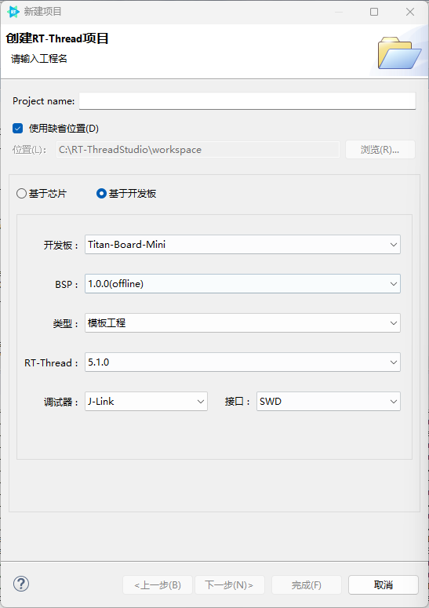
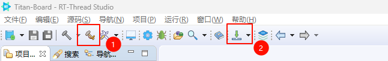

# sdk-bsp-ra8p1-titan-board-mini

**English** | [**Chinese**](README_zh.md)

## Introduction

`sdk-bsp-ra8p1-titan-board-mini` is the Board Support Package (BSP) provided by the RT-Thread team for the **Titan Board Mini**. It can also serve as a software SDK for user development, enabling developers to build their own applications more easily and conveniently.

The **Titan Board Mini** is a development board launched by RT-Thread, based on the Renesas R7KA8P1 chip featuring a dual-core architecture with Cortex-M85 and Cortex-M33. It provides engineers with a flexible and comprehensive development platform, helping developers gain deeper insights and experiences in the field of embedded IoT.


## Directory Structure

```
$ sdk-bsp-ra8p1-titan-board-mini
├── docs
│   ├── Titan_Mini_datasheet.pdf
│   ├── ra8p1-mini_v0.1.pdf
│   ├── Titan_Mini_user_manual.pdf
│   └── templates
├── figures
├── libraries
├── project
│   ├── Titan_Mini_blink_led
│   ├── Titan_Mini_component_flash_fs
│   ├── Titan_Mini_display_camera_mipi_csi
│   ├── Titan_Mini_display_rgb_lvgl
│   ├── Titan_Mini_driver_adc
│   ├── Titan_Mini_driver_canfd
│   ├── Titan_Mini_driver_eth
│   ├── Titan_Mini_driver_gpt
│   ├── Titan_Mini_driver_rtc
│   ├── Titan_Mini_driver_sdcard
│   ├── Titan_Mini_driver_sdram
│   ├── Titan_Mini_driver_spi
│   ├── Titan_Mini_driver_wdt
│   ├── Titan_Mini_key_irq
│   ├── Titan_Mini_peripheral_imu
│   ├── Titan_Mini_rgb_lcd
│   ├── Titan_Mini_template
│   ├── Titan_Mini_usb_pcdc
│   └── Titan_Mini_wavplayer
├── rt-thread
├── test_projects
├── README.md
├── README_zh.md
└── sdk-bsp-ra8p1-titan-board-mini.yaml
```

- `sdk-bsp-ra8p1-titan-board-mini.yaml`: Describes the hardware information of the Titan Board Mini.
- `docs`: Schematics, documents, datasheets, etc., related to the development board.
- `libraries` : General peripheral drivers for Titan Board Mini.
- `project`: Example project folder.
- `rt-thread`:  Source code of RT-Thread.

## Usage

`sdk-bsp-ra8p1-titan-board-mini` supports **RT-Thread Studio** development methods.

## RT-Thread Studio Development Steps

1. Open **RT-Thread Studio** and install the **Titan Board Mini development board support package** (if a newer version is available, it is recommended to install the latest version; the version shown below is for reference only)

2. Create a new Titan Board Mini project by selecting File -> New -> RT-Thread Project -> Based on Development Board. You can create example projects or template projects.



3. Compile and download the project:


