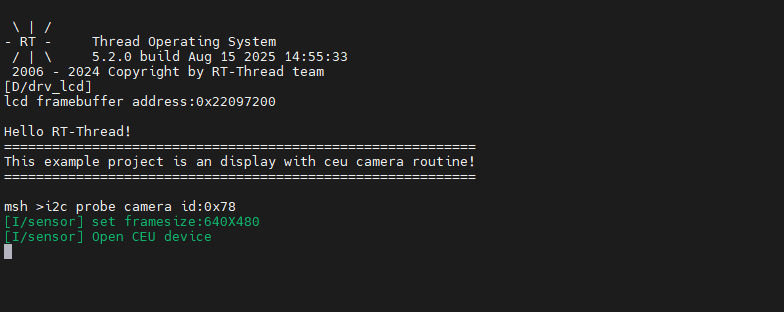

# CEU Camera Usage Guide

[**中文**](README_zh.md)|**English**

## Introduction

This example demonstrates how to use the **CEU (Camera Engine Unit)** interface on the **Titan Board Mini** to connect an **OV5640 camera**, and display captured images on an **RGB565 LCD screen** through the **RT-Thread LCD framework**.

Key features include:

- Initialize CEU camera interface and capture real-time video stream
- Configure OV5640 camera parameters (resolution, frame rate, output format)
- Use RT-Thread LCD driver to display camera-captured images
- Support image format conversion (YUV422 → RGB565)

## RA8 Series CEU (Camera Engine Unit) Features

The RA8 series MCU features a built-in **CEU hardware module** for efficient camera image capture, supporting multiple image formats and resolutions, and transferring data directly to memory or display interfaces.

### 1. CEU Hardware Interface Features

1. **Interface Type**
   - **DVP (Digital Video Port)** interface for connecting CMOS cameras
   - Supports 8/10/12-bit data bus
   - Synchronization signals:
     - **PCLK**: Pixel Clock
     - **HSYNC**: Horizontal Sync
     - **VSYNC**: Vertical Sync
2. **Input Resolution and Frame Rate**
   - Supports common resolutions such as VGA, QVGA, SXGA, UXGA
   - Frame rate support 1-60 fps, configurable for different applications
3. **Camera Compatibility**
   - Compatible with common CMOS cameras such as OV5640, OV7670
   - Supports auto-initialization and register configuration

### 2. Image Format and Processing Capabilities

1. **Image Format Support**
   - **YUV422** (commonly used for video transmission)
   - **RGB565** (suitable for LCD display)
   - **RAW10/RAW12** (for image processing and algorithm development)
2. **Image Processing Functions**
   - **Color Space Conversion**: YUV ↔ RGB
   - **Image Cropping**: Can capture only partial ROI (Region of Interest)
   - **Image Scaling**: Supports proportional scaling down or up
   - **Mirror and Flip**: Can mirror horizontally or vertically
3. **Hardware Acceleration**
   - CEU has built-in hardware processing units to reduce CPU load
   - Provides fast image format conversion and scaling functions

### 3. DMA Support and Buffer Mechanism

1. **High-Speed DMA Transfer**
   - Works with MCU's DMAC for high-speed memory writes
   - Supports writing images directly to Frame Buffer or LCD buffer
2. **Multi-Buffer Mechanism**
   - Supports double buffering or circular buffering for continuous video capture
   - Reduces frame loss and display latency
3. **Flexible DMA Configuration**
   - Configurable buffer start address and size
   - Supports interrupt triggering and callbacks

### 4. Interrupt Mechanism

1. **Interrupt Types**
   - **Frame End Interrupt**: Triggered when each frame capture is complete
   - **Line End Interrupt (optional)**: Triggered when each line capture is complete
   - **Error Interrupt**: Includes buffer overflow, sync signal anomaly
2. **Interrupt Features**
   - Supports RT-Thread ISR callback registration
   - Can work with DMA for real-time processing and display

### 5. Timing and Synchronization Features

1. **Line/Frame Synchronization**
   - HSYNC aligns each line of data
   - VSYNC aligns each frame of image
2. **Pixel Clock**
   - CEU supports external PCLK or internal frequency division
   - Ensures synchronization with camera output to avoid sampling errors
3. **Data Alignment**
   - Supports byte alignment or pixel alignment
   - Can automatically adjust based on image format

### 6. Performance and Optimization

1. **High Throughput**
   - DMA + double buffering mechanism for continuous video capture
   - Low CPU usage, suitable for real-time applications
2. **Reliability**
   - Sync signal anomalies can trigger interrupts
   - Buffer overflow detection
   - Supports automatic frame loss recovery
3. **Flexibility**
   - Supports multi-resolution and multi-format switching
   - Configurable cropping and scaling areas for improved display efficiency

### 7. Application Scenarios

- Real-time video display to LCD
- Video capture and processing algorithm testing
- Embedded vision applications such as surveillance, gesture recognition, robotic vision

## OV5640 Camera Driver

This project uses the **OV5640** 5-megapixel CMOS camera, controlled and configured via **I2C interface**, with image data transmitted via **DVP interface**.

### 1. Hardware Connection

OV5640 camera connection to Titan Board:
- **I2C Control Interface**: Configure camera register parameters
- **DVP Data Interface**: 8-bit parallel data bus
  - D0-D7: Image data
  - PCLK: Pixel clock
  - HSYNC: Horizontal sync
  - VSYNC: Vertical sync
- **Control Pins**: PWDN (power down), RESET (reset)

### 2. Driver Architecture

The camera driver adopts a layered design:

```
Application Layer (hal_entry.c)
    ↓
Sensor Abstraction Layer (sensor.h/sensor.c)
    ↓
OV5640 Driver Layer (ov5640.c/ov5640_regs.h)
    ↓
CEU Hardware Interface Layer (r_ceu.c)
```

**Core Components**:
- **sensor.h/c**: Unified sensor abstraction layer interface
- **ov5640.c/ov5640_regs.h**: OV5640 specific driver implementation and register definitions
- **sensor_utils.c**: Sensor common utility functions

### 3. Supported Features

OV5640 driver supports the following features:
- **Multiple Resolutions**: From QQVGA (160×120) to UXGA (1600×1200)
- **Pixel Formats**: RGB565, YUV422, JPEG, etc.
- **Image Controls**:
  - Auto/Manual Gain Control (AGC)
  - Auto/Manual Exposure Control (AEC)
  - Auto White Balance (AWB)
  - Brightness, contrast, saturation adjustment
- **Image Effects**:
  - Horizontal/vertical mirror
  - Color bar test pattern
  - Special digital effects

## Software Architecture

### 1. Project Structure

```
Titan_Mini_camera_ceu/
├── applications/         # Application code (if used)
├── src/                  # Source files
│   └── hal_entry.c      # Main program entry
├── board/               # Board-level configuration
├── ra/                  # Renesas FSP library
│   └── fsp/src/r_ceu/  # CEU driver implementation
├── ra_gen/              # Generated configuration code
├── ra_cfg/              # FSP configuration files
│   └── fsp_cfg/
│       └── r_ceu_cfg.h # CEU configuration
└── libraries/           # Third-party libraries
    └── Common/ports/ceu_camera/ # CEU camera driver
        ├── sensor.h/c        # Sensor abstraction layer
        └── sensors/
            └── ov5640.c/h   # OV5640 driver
```

### 2. Main Program Flow

The main program (`src/hal_entry.c`) implements a complete camera capture and display flow:

```c
void hal_entry(void)
{
    // 1. Initialize sensor
    sensor_init();

    // 2. Reset sensor
    sensor_reset();

    // 3. Set pixel format to RGB565
    sensor_set_pixformat(PIXFORMAT_RGB565);

    // 4. Set resolution to VGA (640×480)
    sensor_set_framesize(FRAMESIZE_VGA);

    // Main loop
    while(1)
    {
        // 5. Clear image buffer
        memset(g_image_rgb565_sdram_buffer, 0, buffer_size);

        // 6. Capture one frame
        sensor_snapshot(&sensor, g_image_rgb565_sdram_buffer, 0);

        // 7. Display image to LCD
        lcd_draw_jpg(0, 0, g_image_rgb565_sdram_buffer, CAM_WIDTH, CAM_HEIGHT);

        // 8. Short delay
        rt_thread_mdelay(1);

        // 9. LED status indication
        led_status = !led_status;
        rt_pin_write(LED_PIN_1, led_status ? PIN_HIGH : PIN_LOW);
    }
}
```

### 3. Memory Management

- **Image Buffer**: Uses SDRAM to store image data
  - Size: `640 × 480 × 2 = 600KB` (RGB565 format)
  - Placed in `.bss` section, 8-byte aligned
- **SDRAM Driver**: `drv_sdram.c` provides external SDRAM initialization and access

## Display Output

This example uses an **RGB565 LCD screen** as the display output device, controlled through the RT-Thread LCD driver framework:

- **Display Resolution**: Matches camera capture resolution (VGA 640×480)
- **Color Format**: RGB565 (16-bit color depth)
- **Display Driver**: Based on RT-Thread LCD device driver framework
- **Image Display**: Real-time refresh of CEU-captured and converted image data to LCD screen
- **Display Interface**: Uses `lcd_draw_jpg()` function to draw images

## Running Results

### 1. Terminal Output

After resetting Titan Board Mini, the terminal will output the following information:



### 2. Display Effect

The LCD screen will display real-time images captured by the OV5640 camera:
- **Resolution**: 640×480
- **Frame Rate**: Approximately 30 FPS (affected by LCD refresh speed)
- **Color**: RGB565, 16-bit color depth, good display effect
- **LED Indicator**: Onboard LED will flash with frame capture

## Debugging and Optimization

### 1. Common Issues

- **Image Corruption**: Check DVP wiring, timing configuration
- **Low Frame Rate**: Optimize LCD driver, use double buffering
- **Color Abnormality**: Check pixel format configuration, byte order

## Extended Applications

Based on this example, the following applications can be extended:
- **Image Processing**: Add image algorithms (edge detection, color recognition)
- **Video Recording**: Save images to SD card
- **Network Transmission**: Transmit video stream via Ethernet/WiFi
- **Face Recognition**: Integrate AI algorithms for face detection
- **Motion Detection**: Implement frame difference method for moving target detection
