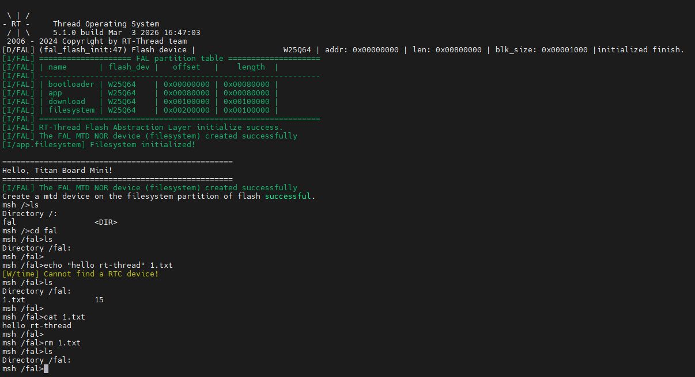

# QSPI Flash File System Example Guide

[**中文**](./README_zh.md) | **English**

## Introduction

This example demonstrates how to implement a **LittleFS file system** using the onboard **QSPI Flash (W25Q64)** on the **Titan Board Mini**, managed through RT-Thread's **FAL (Flash Abstraction Layer)** for Flash device management.

Key features include:

- Use QSPI interface to drive W25Q64 Flash (8MB capacity)
- Manage Flash devices and partitions through FAL abstraction layer
- Mount LittleFS file system to Flash partition
- Provide standard file I/O operation interfaces
- Support file system read/write, create, delete and other operations

## Hardware Introduction

### 1. W25Q64 QSPI Flash

**Titan Board Mini** has an onboard **W25Q64** QSPI Flash chip:

| Parameter | Description |
|-----------|-------------|
| **Model** | W25Q64 |
| **Capacity** | 8MB (64Mbit) |
| **Interface** | QSPI (Quad SPI) |
| **Voltage** | 2.7V - 3.6V |
| **Sector Size** | 4KB |
| **Block Size** | 64KB |
| **Page Size** | 256B |
| **Clock Frequency** | Up to 133MHz (QSPI mode) |

### 2. QSPI Interface Features

QSPI (Quad Serial Peripheral Interface) is a high-speed serial interface:

- **4-bit Data Bus**: 4x data throughput compared to standard SPI
- **High-speed Transfer**: Supports clock frequencies up to 133MHz
- **Low Pin Count**: Only 6 signal lines required (CLK, CS, D0-D3)
- **Hardware Acceleration**: RA8P1 integrates OSPI_B module, supports DMA transfer

## Flash Partition Plan

This example divides the W25Q64 Flash into 4 partitions:

| Partition Name | Start Address | Size | Purpose |
|----------------|---------------|------|---------|
| **bootloader** | 0x000000 | 512KB | Bootloader program |
| **app** | 0x80000 | 512KB | Application firmware |
| **download** | 0x100000 | 1MB | Download cache area |
| **filesystem** | 0x200000 | 1MB | LittleFS file system |

**Flash Partition Layout**:

```
W25Q64 (8MB)
├────────────────┬────────────────┬────────────────┬────────────────┬─────────────
│  Bootloader    │      App       │    Download    │   Filesystem   │   Reserved
│    512KB       │     512KB      │      1MB       │      1MB       │    4MB
└────────────────┴────────────────┴────────────────┴────────────────┴─────────────
0x000000        0x080000        0x100000        0x200000        0x300000
```

## Software Architecture

### 1. Layered Design

The file system adopts a layered architecture design:

```
Application Layer (user code)
    ↓
DFS (Device File System) - RT-Thread file system abstraction layer
    ↓
LittleFS - Lightweight embedded file system
    ↓
FAL (Flash Abstraction Layer) - Flash abstraction layer
    ↓
MTD (Memory Technology Device) - Memory device driver
    ↓
W25Q64 QSPI Driver - Hardware driver layer
    ↓
QSPI/OSPI_B hardware interface
```

### 2. Core Components

#### FAL (Flash Abstraction Layer)

FAL provides unified management interfaces for Flash devices and partitions:

- **Flash Device Table**: Define Flash devices in the system
- **Partition Table**: Define Flash partition layout
- **Abstract Interface**: Provide unified read/write/erase operations

**FAL Configuration** (`fal_cfg.h`):

```c
/* Flash device table */
#define FAL_FLASH_DEV_TABLE  \
{                             \
    &w25q64,                  \
}

/* Partition table */
#define FAL_PART_TABLE  \
{                        \
    {FAL_PART_MAGIC_WORD, "bootloader", "W25Q64", 0,  512 * 1024, 0}, \
    {FAL_PART_MAGIC_WORD,        "app", "W25Q64", 512 * 1024,  512 * 1024, 0}, \
    {FAL_PART_MAGIC_WORD,   "download", "W25Q64", (512 + 512) * 1024, 1024 * 1024, 0}, \
    {FAL_PART_MAGIC_WORD, "filesystem", "W25Q64", (512 + 512 + 1024) * 1024, 1024 * 1024, 0}, \
}
```

#### LittleFS File System

LittleFS is a file system designed specifically for embedded systems:

- **Power-safe**: Uses Copy-on-Write mechanism to ensure data integrity
- **Wear Leveling**: Automatically performs Flash wear leveling to extend Flash life
- **Low Memory Footprint**: Small RAM usage, suitable for resource-constrained systems
- **Dynamic Size**: File system size can be adjusted as needed

#### W25Q64 QSPI Driver

W25Q64 driver provides Flash hardware operation interfaces:

- **Read Operation**: Supports fast read (Quad Read)
- **Write Operation**: Page programming (256B/page)
- **Erase Operation**: Supports 4KB sector erase and 64KB block erase
- **Status Query**: Query Flash busy status and write enable status

### 3. Project Structure

```
Titan_Mini_component_flash_fs/
├── src/
│   └── hal_entry.c          # Main program entry
├── libraries/
│   └── Common/ports/
│       ├── fal_cfg.h        # FAL configuration
│       └── w25q64/
│           ├── drv_w25q64.c # W25Q64 driver
│           └── ospi_b_commands.c # QSPI commands
└── packages/
    └── littlefs-v2.5.0/     # LittleFS file system
        ├── lfs.c           # LittleFS core
        ├── lfs_util.c      # Utility functions
        └── dfs_lfs.c       # DFS adapter layer
```

## Usage Examples

### 1. Initialization Flow

The main program (`src/hal_entry.c`) implements a complete file system initialization flow:

```c
#define FS_PARTITION_NAME   "filesystem"

void hal_entry(void)
{
    rt_kprintf("\n==================================================\n");
    rt_kprintf("Hello, Titan Board Mini!\n");
    rt_kprintf("==================================================\n");

    // 1. Initialize FAL (Flash abstraction layer)
    extern int fal_init(void);
    fal_init();

    // 2. Create MTD device
    extern struct rt_device* fal_mtd_nor_device_create(const char *parition_name);
    struct rt_device *mtd_dev = fal_mtd_nor_device_create(FS_PARTITION_NAME);

    if (mtd_dev == NULL)
    {
        rt_kprintf("Can't create a mtd device on '%s' partition.\n", FS_PARTITION_NAME);
    }
    else
    {
        rt_kprintf("Create a mtd device on the %s partition of flash successful.\n", FS_PARTITION_NAME);
    }

    // Main loop - LED blinking
    while (1)
    {
        rt_pin_write(LED_PIN_R, PIN_HIGH);
        rt_thread_mdelay(500);
        rt_pin_write(LED_PIN_R, PIN_LOW);
        rt_thread_mdelay(500);
    }
}
```

### 2. File Operation Examples

After the file system is initialized, standard POSIX file I/O interfaces can be used:

```c
#include <dfs_file.h>

/* Write file example */
void write_file_example(void)
{
    FILE *fp = fopen("/filesystem/test.txt", "w");
    if (fp != NULL)
    {
        fprintf(fp, "Hello, Titan Board!\n");
        fprintf(fp, "This is a test file.\n");
        fclose(fp);
        rt_kprintf("File written successfully.\n");
    }
}

/* Read file example */
void read_file_example(void)
{
    char buffer[128];
    FILE *fp = fopen("/filesystem/test.txt", "r");
    if (fp != NULL)
    {
        while (fgets(buffer, sizeof(buffer), fp) != NULL)
        {
            rt_kprintf("%s", buffer);
        }
        fclose(fp);
    }
}

/* List files example */
void list_files_example(void)
{
    DIR *dir = opendir("/filesystem");
    if (dir != NULL)
    {
        struct dirent *entry;
        while ((entry = readdir(dir)) != NULL)
        {
            rt_kprintf("File: %s\n", entry->d_name);
        }
        closedir(dir);
    }
}
```

## Running Results

### 1. Terminal Output

After resetting Titan Board Mini, the terminal will output the following information:



### 2. File System Testing

The file system can be tested in the msh command line:

```bash
msh >ls /filesystem
test.txt
config.ini
msh >cat /filesystem/test.txt
Hello, Titan Board!
This is a test file.
msh >
```

## Notes

### 1. Flash Usage Limitations

- **Erase Cycles**: W25Q64 sector erase cycles are approximately 100,000 times
- **Data Retention**: Data retention time at room temperature is about 20 years
- **Erase Before Write**: Flash must be erased before writing
- **Alignment Requirements**: Write and erase operations need to be aligned to sectors/pages

### 2. File System Recommendations

- **Small File Optimization**: LittleFS is suitable for frequent small file read/write operations
- **Power Protection**: Use LittleFS's power-safe features
- **Regular Backup**: Important data should be backed up to other storage media
- **Capacity Planning**: Reserve some space for wear leveling

### 3. Performance Optimization

- **DMA Transfer**: Use DMA to improve QSPI transfer efficiency
- **Cache Optimization**: Configure file system cache size appropriately
- **Batch Operations**: Try to read/write in batches to reduce operation count
- **Error Handling**: Add appropriate error handling and retry mechanisms

## Extended Applications

Based on this example, the following applications can be extended:

- **Configuration Storage**: Store system configuration parameters
- **Logging System**: Implement circular logging
- **OTA Upgrade**: Store new firmware for OTA upgrade
- **Data Cache**: Cache sensor data
- **Resource Storage**: Store images, audio, fonts and other resource files
- **Offline Data**: Store offline database
- **Firmware Backup**: Backup multiple firmware for A/B upgrade

## Related Resources

- [LittleFS Official Documentation](https://github.com/littlefs-project/littlefs)
- [RT-Thread FAL Documentation](https://www.rt-thread.org/document/site/#/rt-thread-version/rt-thread-standard/programming-manual/fal/fal)
- [RA8P1 Hardware Manual](https://www.renesas.cn/zh/document/mah/25574257)
