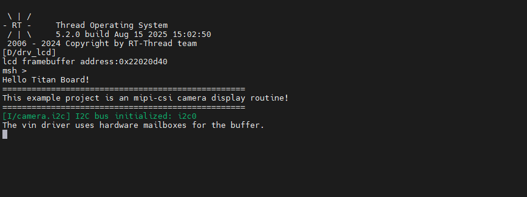
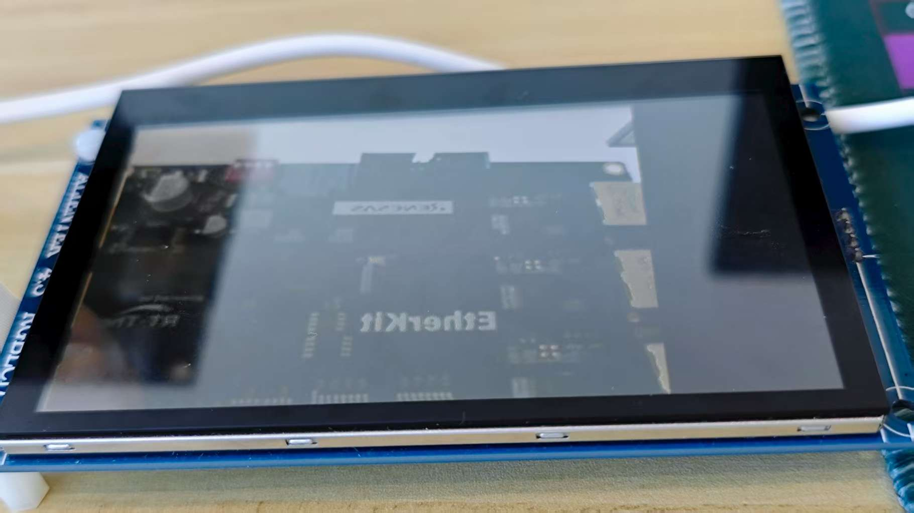

# MIPI CSI Camera Usage Instructions

**English**|[**Chinese**](README_zh.md)

## Introduction

This example demonstrates how to use the **MIPI CSI (Camera Serial Interface)** on the **Titan Board** to connect an **OV5640 camera**, and display the captured images on an **RGB565 LCD screen** via the **RT-Thread LCD framework**.

Key functionalities include:

- Initialize the MIPI CSI camera interface to capture real-time video streams
- Configure OV5640 camera parameters (resolution, frame rate, output format)
- Display captured images using the RT-Thread LCD driver
- Support image format conversion (YUV422 → RGB565)

## RA8 Series MIPI CSI Features

The RA8 series MCU integrates a **MIPI CSI hardware module** for high-speed, low-power camera data acquisition, suitable for HD video and real-time image processing.

### 1. Hardware Interface Features

1. **Interface Type**
   - **MIPI CSI-2** D-PHY interface for high-bandwidth serial data transmission
   - Supports 1–4 data lanes
   - Synchronization is handled by MIPI D-PHY; no additional HSYNC/VSYNC required
2. **Data Rate and Resolution**
   - Supports up to 1.5–2.5 Gbps per lane (depending on MCU series and PHY configuration)
   - Can drive common camera resolutions: VGA, QVGA, SXGA, UXGA, 1080p, etc.
3. **Camera Compatibility**
   - Compatible with OV5640, IMX219, and other common CMOS cameras
   - Supports camera register configuration and auto-initialization

### 2. Image Formats and Processing Capabilities

1. **Supported Image Formats**
   - **RAW10 / RAW12** (for algorithm development and image processing)
   - **YUV422** (for video display)
   - **RGB565** (suitable for LCD display)
2. **Image Processing Features**
   - **Color space conversion** (YUV → RGB)
   - **Image cropping** (ROI capture)
   - **Mirror and flip**
   - **Hardware accelerated scaling**
3. **Hardware Acceleration**
   - MIPI CSI includes built-in DMA to reduce CPU load
   - Supports high-speed format conversion and scaling

### 3. DMA Support and Buffering

1. **High-Speed DMA Transfer**
   - Works with MCU DMAC to write images directly to memory or LCD buffer
   - Reduces CPU intervention and increases frame rate
2. **Multi-Buffer Mechanism**
   - Supports double buffering or ring buffers for continuous video capture
   - Prevents frame loss and display latency
3. **Flexible DMA Configuration**
   - Configurable buffer start address and size
   - Supports interrupt callback handling

### 4. Interrupt Mechanism

1. **Interrupt Types**
   - **Frame End Interrupt**: triggered at the end of each frame capture
   - **Line End Interrupt (optional)**
   - **Error Interrupt**: buffer overflow, PHY errors, etc.
2. **Interrupt Features**
   - Supports RT-Thread ISR callbacks
   - Can work with DMA to enable real-time display

### 5. Timing and Synchronization Features

1. **Synchronization Method**
   - CSI relies on MIPI D-PHY for clock and data synchronization
   - No additional HSYNC/VSYNC required
2. **Pixel Clock and Data Alignment**
   - Supports pixel-aligned or byte-aligned data
   - Automatically handles RAW/YUV/RGB data alignment

### 6. Performance Optimization

1. **High Throughput**
   - DMA + double buffering enables continuous video capture
   - Low CPU usage suitable for real-time applications
2. **Reliability**
   - PHY errors or data loss interrupts can trigger exception handling
   - Supports buffer overflow detection
3. **Flexibility**
   - Supports multiple resolutions and formats
   - ROI capture and hardware scaling improve display efficiency

### 7. Application Scenarios

- Real-time video display on LCD
- Video capture and processing algorithm verification
- Embedded vision applications such as surveillance, gesture recognition, and robotics vision

## RA8 Series MCU GLCDC (Graphics LCD Controller) Features

The RA8 series MCU (e.g., RA8P1) integrates a **GLCDC hardware module** for driving TFT/LCD displays, enabling high-speed graphics rendering and video display, supporting multiple resolutions, color formats, and display modes.

### 1. Hardware Features

1. **Resolution Support**
   - Can drive common resolutions from QVGA (320×240) to WQVGA/XGA
   - Limited by on-chip RAM and display interface bandwidth
2. **Color Support**
   - Supports 1/4/8/16/24/32-bit color depth
   - Common formats: RGB565, RGB888
   - Supports palette mode (CLUT)
   - Hardware color conversion available
3. **Interface Types**
   - Parallel RGB (TFT LCD interface)
   - Supports 16/18/24-bit data bus
   - Direct connection to external LCD panels
   - Programmable timing: HSYNC, VSYNC, DE, PCLK, RGB output

### 2. Layers and Display Modes

1. **Layer Support**
   - Single-layer mode (single screen display)
   - Multi-layer mode (palette or hardware alpha blending)
   - Supports transparent/semi-transparent overlay
2. **Display Modes**
   - RGB mode (direct color output)
   - CLUT/Palette mode (indexed color via lookup table)
   - Configurable scan direction (horizontal/vertical)

### 3. DMA and Frame Buffer

1. **Frame Buffer Access**
   - GLCDC can directly access on-chip or external SRAM frame buffer
   - Supports single or double buffering
   - Supports ring buffer for continuous refresh
2. **DMA Support**
   - Works with MCU DMAC to reduce CPU usage
   - Can transfer images directly from memory to LCD
   - Supports line, block, or full-frame transfer

### 4. Hardware Graphics Functions

1. **Window Cropping and Scaling**
   - Can specify display window area
   - Supports simple horizontal/vertical scaling
2. **Hardware Graphics Acceleration**
   - Rectangle fill, color replacement
   - Image transparency processing
   - Can be combined with CEU or DMA for video display
3. **Color Format Conversion**
   - YCbCr → RGB
   - RGB888 → RGB565
   - Hardware accelerated to reduce CPU load

### 5. Interrupt Mechanism

1. **Interrupt Types**
   - Frame End
   - Line End (optional)
   - Access error/overflow
2. **Interrupt Application**
   - Integrates with RT-Thread ISR
   - Can trigger buffer update or double-buffer swap on frame completion
   - Enables smooth animations and video display

### 6. Performance Optimization

1. **Double Buffer Mechanism**
   - Reduces flicker
   - CPU can render next frame in background
   - GLCDC hardware automatically switches display buffer
2. **Frame Rate Control**
   - Programmable clock and line/frame synchronization
   - Supports common refresh rates (30fps, 60fps)
3. **CPU Offload**
   - Many graphics operations performed in hardware
   - DMA + GLCDC combination enables efficient image display

## Compilation & Download

- **RT-Thread Studio**: In RT-Thread Studio’s package manager, download the Titan Board resource package, create a new project, and compile it.

After compilation, connect the development board’s USB-DBG interface to the PC and download the firmware to the development board.

## Run Effect

After resetting the Titan Board, the terminal will output the following message:

Here is the image displayed on the LCD screen:

