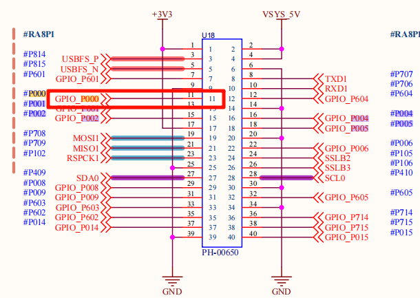
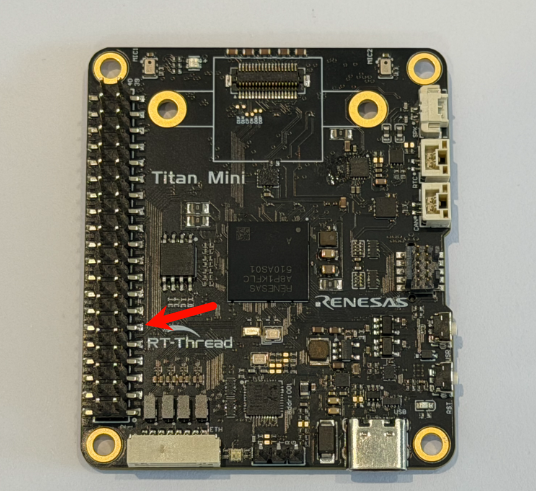
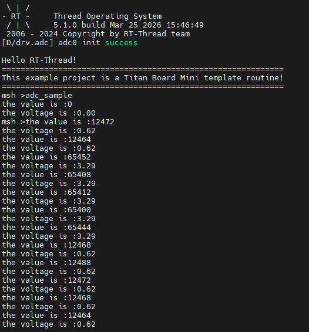

# ADC Driver Example

[**Chinese**](README_zh.md) | **English**

## Introduction

This example demonstrates how to implement analog-to-digital conversion functionality for the RA8P1 microcontroller on **Titan Board Mini** using the **RT-Thread ADC device driver framework**. The project provides a comprehensive solution including ADC initialization, sampling, voltage conversion, and thread management.

### Key Features

- **RA8P1 ADC Hardware Abstraction Layer** - Complete 16-bit ADC driver support
- **RT-Thread Device Framework Integration** - Standardized device management and control interfaces
- **Multi-threaded Concurrent Processing** - Background thread for continuous sampling and data display
- **Real-time Voltage Conversion** - Precise conversion from analog signals to digital signals
- **Low-power Design** - Supports dynamic enable/disable of ADC channels
- **Command Line Interface** - Quick sampling startup via `adc_sample` command

---

## 1. Hardware Overview

### 1.1 RA8P1 Microcontroller Overview

**RA8P1** is a high-performance ARM Cortex-M85 microcontroller from Renesas, designed for edge AI and real-time applications:

- **Core Architecture**: ARM Cortex-M85 @ 1GHz (supports Helium MVE vector extension)
- **Coprocessor**: ARM Cortex-M33 @ 250MHz (real-time control core)
- **Memory Configuration**: 2MB SRAM (with ECC), supports TCM (Tightly Coupled Memory)
- **AI Acceleration**: Built-in Ethos-U55 NPU, supports neural network inference

### 1.2 ADC Hardware Features

RA8P1 integrates an advanced analog-to-digital conversion subsystem:

#### 1.2.1 ADC Core Parameters

| Parameter | Specification | Description |
|-----------|---------------|-------------|
| **Resolution** | 16-bit | High-precision conversion, maximum 65536 quantization levels |
| **Sampling Rate** | Up to 23 channels | Multi-channel synchronous sampling support |
| **Reference Voltage** | 3.3V (330mV) | Built-in high-precision voltage reference |
| **Data Interface** | 16-bit parallel | High-speed data transfer interface |
| **DMA Support** | 8-channel DMA | CPU-independent data acquisition |

#### 1.2.2 ADC Electrical Characteristics

```c
// Reference voltage configuration
#define REFER_VOLTAGE       330     // 3.30V × 100 (precision preserved to 2 decimal places)
#define CONVERT_BITS        (1 << 16) // 16-bit resolution = 65536

// Voltage calculation formula
// Actual voltage(mV) = ADC reading × Reference voltage(mV) / Conversion bits
// Voltage(V) = (ADC reading × 3.3V) / 65536
```

#### 1.2.3 ADC Channel Configuration

- **Channel Count**: 23 analog input channels
- **Channel Selection**: Dynamically configurable via software
- **Input Range**: 0V ~ 3.3V unipolar input
- **Sample & Hold**: Built-in sample-and-hold circuit
- **Trigger Modes**: Software trigger, timer trigger, external event trigger

### 1.3 Hardware Connection Diagram



---

## 2. Software Architecture

### 2.1 RT-Thread ADC Driver Framework

RT-Thread provides a unified ADC device driver framework supporting multiple microcontroller platforms:

#### 2.1.1 Device Management Interfaces

```c
// ADC device management core interfaces
rt_err_t rt_adc_enable(rt_adc_device_t dev, rt_uint32_t channel);    // Enable ADC channel
rt_err_t rt_adc_disable(rt_adc_device_t dev, rt_uint32_t channel);   // Disable ADC channel
rt_uint32_t rt_adc_read(rt_adc_device_t dev, rt_uint32_t channel);   // Read ADC value
```

#### 2.1.2 Device Lifecycle

```
Device init → Device find → Device enable → Data sampling → Device disable → Resource release
     ↓           ↓          ↓              ↓              ↓              ↓
   rt_device_init  rt_device_find  rt_adc_enable  rt_adc_read  rt_adc_disable  rt_device_close
```

### 2.2 Project Software Architecture

```
Titan_Mini_driver_adc/
├── src/
│   └── hal_entry.c          # Main entry file, contains ADC sampling logic
├── Kconfig                   # RT-Thread configuration
├── SConstruct                # Build script
├── libraries/               # HAL library files
│   └── HAL_Drivers/         # Hardware abstraction layer drivers
└── rt-thread/               # RT-Thread kernel
    └── components/
        └── drivers/          # Device driver framework
```

#### 2.2.1 Module Division

| Module | Function | File Location |
|--------|----------|---------------|
| **Application Layer** | User interface and business logic | `src/hal_entry.c` |
| **Device Layer** | ADC device management | `rt-thread/components/drivers/` |
| **Hardware Layer** | Low-level hardware drivers | `libraries/HAL_Drivers/` |
| **Configuration Layer** | System configuration | `Kconfig`, `rtconfig.h` |

### 2.3 Program Execution Flow

```c
// Main program execution flow
void hal_entry(void) {
    // 1. Initialize system
    rt_kprintf("Hello RT-Thread!\n");

    // 2. Configure LED indicator
    rt_pin_mode(LED_PIN_R, PIN_MODE_OUTPUT);

    // 3. Enter main loop (LED blinking)
    while(1) {
        rt_pin_write(LED_PIN_R, PIN_LOW);
        rt_thread_mdelay(500);
        rt_pin_write(LED_PIN_R, PIN_HIGH);
        rt_thread_mdelay(500);
    }
}

// ADC sampling thread startup
void adc_sample() {
    // Create independent thread for ADC sampling
    rt_thread_t adc_thread = rt_thread_create(
        "adc",           // Thread name
        adc_vol_sample,  // Thread entry function
        RT_NULL,         // Thread parameter
        1024,            // Thread stack size
        10,              // Priority
        10               // Time slice
    );
    rt_thread_startup(adc_thread);
}
```

---

## 3. Usage Examples

### 3.1 Basic ADC Sampling

#### 3.1.1 Device Initialization and Finding

```c
// ADC device configuration constants
#define ADC_DEV_NAME        "adc0"      // ADC device name
#define ADC_DEV_CHANNEL     0           // ADC channel number
#define REFER_VOLTAGE       330         // Reference voltage (3.3V × 100)
#define CONVERT_BITS        (1 << 16)    // 16-bit resolution

// ADC device initialization function
int adc_vol_sample()
{
    rt_adc_device_t adc_dev;           // ADC device handle
    rt_uint32_t value, vol;            // ADC value and voltage value
    rt_err_t ret = RT_EOK;             // Return status code

    // 1. Find ADC device
    adc_dev = (rt_adc_device_t)rt_device_find(ADC_DEV_NAME);
    if (adc_dev == RT_NULL)
    {
        rt_kprintf("adc sample run failed! can't find %s device!\n", ADC_DEV_NAME);
        return RT_ERROR;
    }

    // 2. Enable ADC channel
    ret = rt_adc_enable(adc_dev, ADC_DEV_CHANNEL);
    if (ret != RT_EOK)
    {
        rt_kprintf("adc enable failed! ret = %d\n", ret);
        return ret;
    }

    // 3. Enter sampling loop
    while(1)
    {
        // 4. Read ADC raw value
        value = rt_adc_read(adc_dev, ADC_DEV_CHANNEL);
        rt_kprintf("the value is :%d \n", value);

        // 5. Convert to voltage value (unit: mV)
        vol = value * REFER_VOLTAGE / CONVERT_BITS;
        rt_kprintf("the voltage is :%d.%02d \n", vol / 100, vol % 100);

        // 6. Delay 1 second
        rt_thread_mdelay(1000);
    }

    // 7. Disable ADC channel (theoretically will not reach here)
    ret = rt_adc_disable(adc_dev, ADC_DEV_CHANNEL);
    return ret;
}
```

#### 3.1.2 Voltage Calculation Details

Voltage conversion uses fixed-point arithmetic to ensure precision:

```c
// Raw ADC value range: 0 ~ 65535 (16-bit)
// Reference voltage: 3.3V = 330mV
// Conversion formula: Voltage(mV) = (ADC value × 330mV) / 65536

// Example calculation:
// When ADC reading is 32768 (half of full scale)
vol = 32768 * 330 / 65536;
// vol = 16500 mV = 1.65V

// Display formatted output:
// vol / 100 = 165   (integer part, volts)
// vol % 100 = 0     (decimal part, hundredths of volts)
// Output: "the voltage is :165.00"
```

### 3.2 Multi-threading Implementation

#### 3.2.1 Thread Creation and Startup

```c
// Create ADC sampling thread
void adc_sample()
{
    rt_thread_t adc = rt_thread_create("adc", adc_vol_sample, RT_NULL, 1024, 10, 10);

    // Start thread
    if (adc != RT_NULL)
    {
        rt_thread_startup(adc);
        rt_kprintf("ADC sampling thread started successfully!\n");
    }
    else
    {
        rt_kprintf("Failed to create ADC sampling thread!\n");
    }
}

// Export as MSH command
MSH_CMD_EXPORT(adc_sample, adc_sample);
```

#### 3.2.2 Thread Synchronization Mechanisms

RT-Thread provides rich thread synchronization mechanisms:

```c
// Can add mutex to protect ADC device access
static rt_mutex_t adc_mutex = RT_NULL;

// Create mutex in ADC initialization
rt_mutex_init(&adc_mutex, "adc_mutex", RT_IPC_FLAG_FIFO);

// Use mutex in ADC sampling
rt_mutex_take(adc_mutex, RT_WAITING_FOREVER);
// Perform ADC operations
rt_mutex_release(adc_mutex);
```

### 3.3 Command Line Interface Usage

#### 3.3.1 Terminal Commands

```bash
# 1. Probe if ADC device exists
msh >adc probe adc0
probe adc0 success

# 2. Start ADC sampling (command provided by this program)
msh >adc_sample
ADC sampling thread started successfully!

# 3. Use RT-Thread built-in commands to manage ADC
msh >adc enable 0
adc0 channel 0 enables success

msh >adc read 0
adc0 channel 0 read value is 0x1234

msh >adc disable 0
adc0 channel 0 disable success
```

---

## 4. Running Results

### 4.1 Terminal Output Example

#### 4.1.1 Startup Information

Connect a dupont wire between 3.3V and the ADC pin as shown below



Then run the example adc_sample through the serial terminal



---

## 5. Reference Resources

### 5.1 Technical Documentation

1. **RT-Thread Official Documentation**
   - [RT-Thread ADC Device](https://www.rt-thread.org/document/site/#/rt-thread-version/rt-thread-standard/programming-manual/device/adc/adc)
   - [RT-Thread Device Driver Model](https://www.rt-thread.org/document/site/#/rt-thread-version/rt-thread-standard/programming-manual/device/driver)
   - [RT-Thread Development Guide](https://www.rt-thread.org/document/site/)
