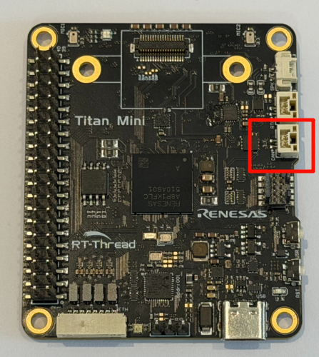
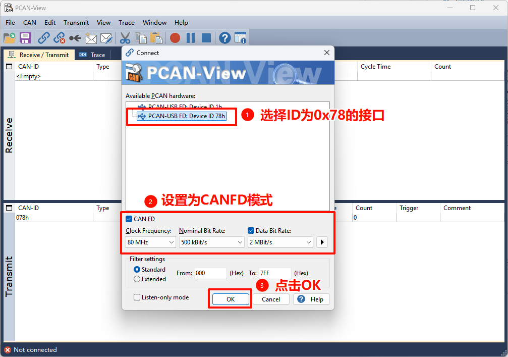
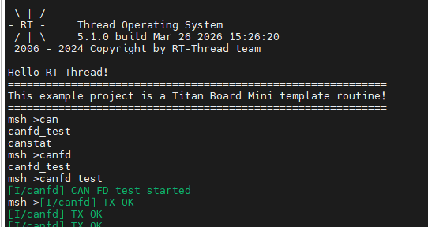
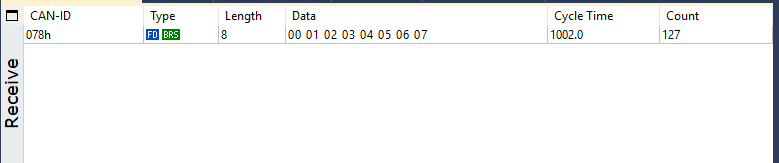
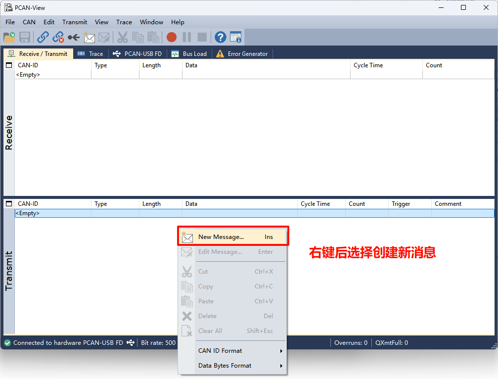
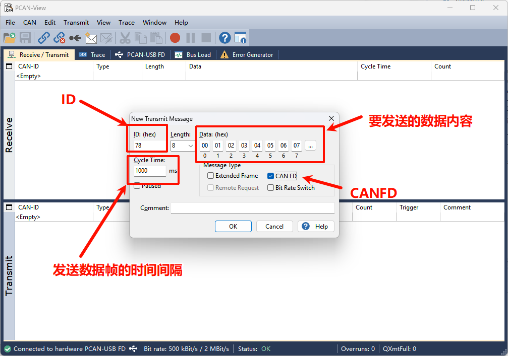
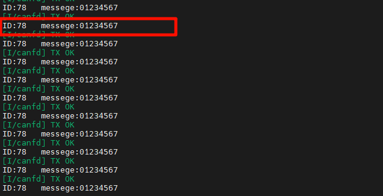

# CAN FD 驱动示例说明

[**中文**](README_zh.md) | **English**

## 简介

本文档详细介绍了在 **Titan Board Mini** 开发板上基于 **RA8P1** 微控制器实现的 **CAN FD (Controller Area Network with Flexible Data-Rate)** 驱动程序。CAN FD 是传统CAN协议的增强版本，在保持向后兼容性的同时提供了更高的数据传输速率和更大的数据负载容量。

### 主要特性

- **高性能CAN FD通信**：支持最高8 Mbps的数据传输速率
- **大容量数据传输**：每帧最多支持64字节数据（传统CAN仅8字节）
- **双速率模式**：仲裁阶段和数据阶段可设置不同的波特率
- **RT-Thread统一驱动框架**：标准化的设备操作接口
- **中断驱动的收发机制**：高效的异步通信处理
- **完整错误检测**：增强的错误检测和处理机制

---

### RA8P1 CAN FD硬件特性

**RA8P1** 是瑞萨电子推出的高性能微控制器，基于 **Arm Cortex-M85** 内核，具备强大的CAN FD外设功能：

#### 核心特性
- **处理器架构**: Arm Cortex-M85 @ 1GHz (RA8P1) + Arm Ethos-U55 @ 500MHz (NPU)
- **工作频率**: 800MHz / 1GHz 可选
- **内存配置**: 2MB SRAM (ECC保护), 512KB MRAM, 4-8MB Flash选项

#### CAN FD外设规格
- **CAN FD通道数**: 2个独立的CAN FD通道
- **最大仲裁波特率**: 1 Mbps
- **最大数据波特率**: **8 Mbps** (行业领先水平)
- **过滤器规则**: 16个/通道
- **发送消息缓冲区**: **16个/通道**
- **接收缓冲区**: **16个/通道**
- **接收FIFO**: 2个/通道
- **接收缓冲区RAM**: 1216字节
- **通用FIFO**: 1个/通道
- **64字节存储**: 16消息

#### 时钟和定时器
- **CAN时钟频率**: 40MHz (推荐配置)
- **位时间精度**: 高精度位时间配置
- **采样点配置**: 可编程采样点 (50%-87.5%)
- **同步跳转宽度**: 1-128个时间量子

---

## 软件架构 - RT-Thread CAN设备框架

### RT-Thread驱动模型

RT-Thread提供了一个统一的I/O设备管理框架，CAN设备作为其中的一类设备（`RT_Device_Class_CAN`）被集成到系统中。

#### 设备管理三层架构

```
┌─────────────────────────┐
│    应用层               │
│  (Application Layer)    │
├─────────────────────────┤
│    I/O设备管理层        │
│ (Device Management Layer)│
├─────────────────────────┤
│    设备驱动层           │
│ (Driver Layer)          │
└─────────────────────────┘
```

#### 核心数据结构

```c
struct rt_can_device {
    struct rt_device parent;           /* 设备基类 */
    const struct rt_can_ops *ops;      /* 设备操作接口 */
    struct can_configure config;       /* 设备配置 */
    struct rt_can_status status;       /* 设备状态 */
    rt_uint32_t timer_init_flag;       /* 定时器初始化标志 */
    struct rt_timer timer;            /* 定时器 */
    struct rt_can_status_ind_type status_indicate; /* 状态指示 */
    struct rt_mutex lock;             /* 互斥锁 */
    void *can_rx;                     /* 接收缓冲区 */
    void *can_tx;                     /* 发送缓冲区 */
};
```

### CAN设备操作接口

RT-Thread CAN设备框架提供标准化的操作接口：

#### 设备查找和初始化
```c
rt_device_t rt_device_find(const char *name);      // 查找设备
rt_err_t rt_device_open(rt_device_t dev, rt_uint16_t oflag); // 打开设备
```

#### 数据读写操作
```c
rt_size_t rt_device_read(rt_device_t dev, rt_off_t pos, void *buffer, rt_size_t size);  // 读取数据
rt_size_t rt_device_write(rt_device_t dev, rt_off_t pos, const void *buffer, rt_size_t size); // 写入数据
```

#### 中断和回调配置
```c
rt_err_t rt_device_set_rx_indicate(rt_device_t dev, rt_err_t(*rx_ind)(rt_device_t dev, rt_size_t size)); // 设置接收回调
rt_err_t rt_device_set_tx_complete(rt_device_t dev, rt_err_t(*tx_complete)(rt_device_t dev, void *buffer)); // 设置发送完成回调
```

### 中断处理机制

CAN FD采用中断驱动的通信机制，主要包括：

#### 接收中断处理
1. **硬件中断触发**: CAN接收到数据帧
2. **中断服务程序**: 读取硬件状态寄存器
3. **数据搬移**: 将数据从硬件缓冲区复制到应用缓冲区
4. **回调通知**: 通过信号量通知接收线程
5. **线程处理**: 接收线程处理数据并应用逻辑

#### 发送中断处理
1. **发送请求**: 应用调用发送接口
2. **缓冲区检查**: 检查发送缓冲区可用性
3. **数据写入**: 将数据写入发送缓冲区
4. **启动发送**: 触发硬件发送过程
5. **发送完成**: 发送完成后触发中断

#### 错误中断处理
CAN FD支持多种错误检测机制：
- **位错误检测**: 检测发送和接收位不一致
- **stuffing错误**: 检测位 stuffing 错误
- **CRC错误**: 使用增强的17位或21位CRC
- **格式错误**: 检测帧格式错误
- **超载错误**: 处理总线过载情况

---

## 运行效果示例

本节介绍如何使用 **PCAN-View** 工具与 Titan Board Mini 进行 CAN FD 通信测试。

### 1. 硬件连接

#### 1.1 连接 CAN 接口

将 Titan Board Mini 的 CAN 接口与 PCAN 适配器进行连接：



> **注意**：请确保接线正确，CAN_H 和 CAN_L 不能接反，否则会导致通信失败。

### 2. PCAN-View 软件配置

#### 2.1 启动 PCAN-View

打开 PCAN-View 软件，进行连接配置：



**配置步骤**：
1. 选择 PCAN 适配器类型（如 PCAN-USB FD）
2. 选择 CAN 通道（Channel 1 或 Channel 2）
3. 设置波特率
4. 选择 CAN FD 模式
5. 点击 "ok" 按钮建立连接

#### 2.2 PCAN-View 显示配置

在 PCAN-View 中配置显示选项：

- **显示格式**：Hex（十六进制）
- **时间戳**：启用
- **帧类型**：标准和扩展帧都显示

### 3. 终端命令操作

#### 3.1 启动开发板程序

在终端中复位开发板后，先通过 MSH 输入 `canfd_test` 命令启动示例（该命令会创建收发线程并开始发送 CAN FD 消息）。



#### 3.2 启动 CAN 测试程序

运行测试程序开始发送 CAN FD 消息：

### 4. 数据收发测试

#### 4.1 接收开发板发送的数据

程序运行后，PCAN-View 将接收到 Titan Board Mini 发送的 CAN FD 消息：




#### 4.2 从 PCAN-View 发送数据

通过 PCAN-View 向开发板发送 CAN FD 消息：

**配置发送参数**：
1. 在 PCAN-View 的 "Transmit" 部分右键弹出New Message
2. 配置消息参数：
   - **ID**：0x78
   - **帧类型**：CAN FD
   - **数据长度**：8 字节
   - **数据**：自定义数据内容





#### 4.3 在终端查看接收到的数据

开发板接收到 PCAN-View 发送的消息后，终端会显示接收到的数据：




