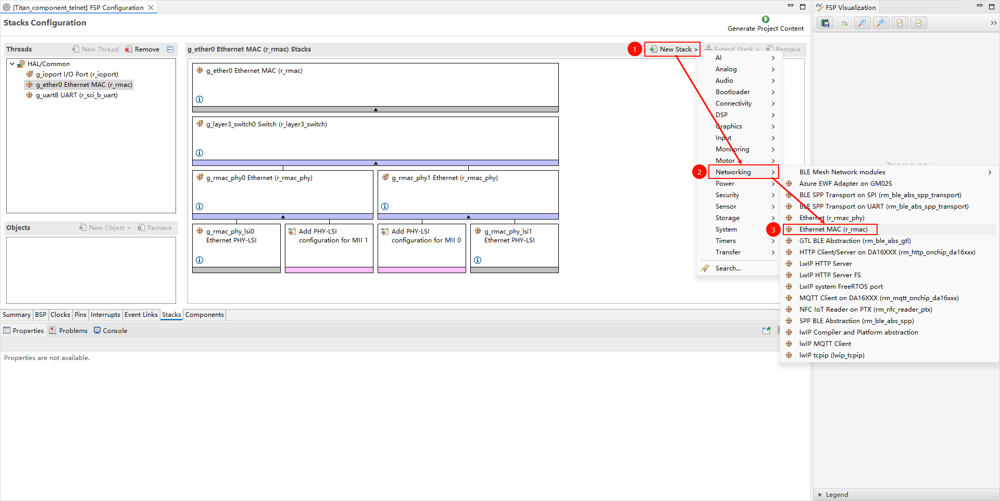
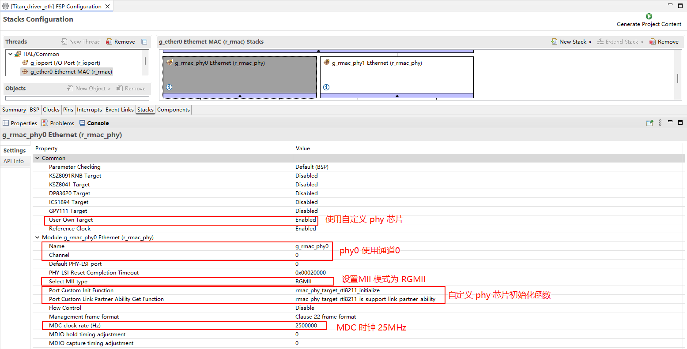
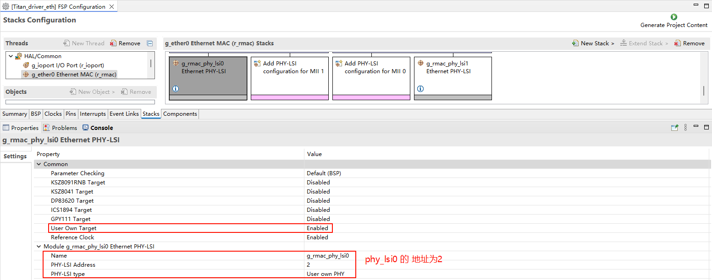
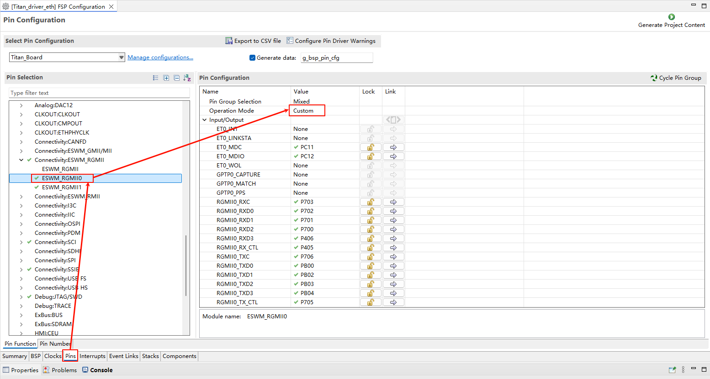
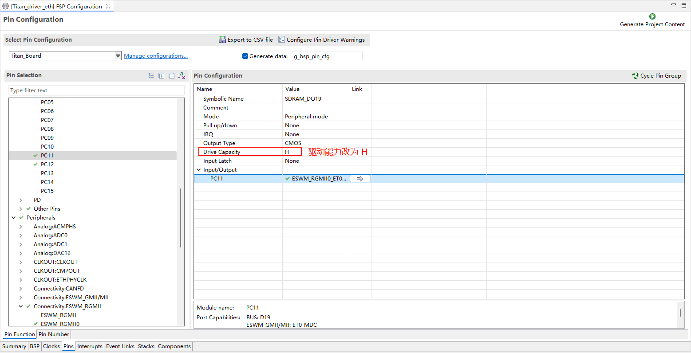
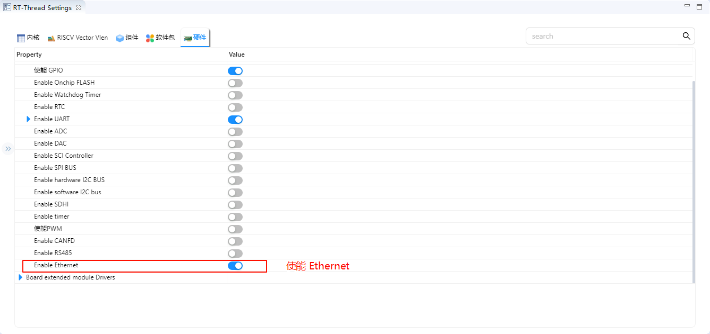
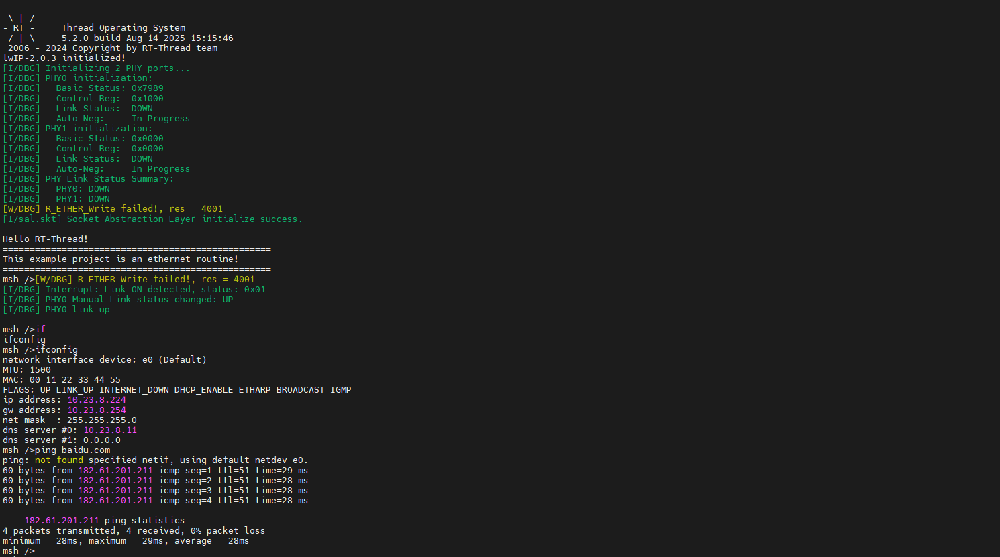
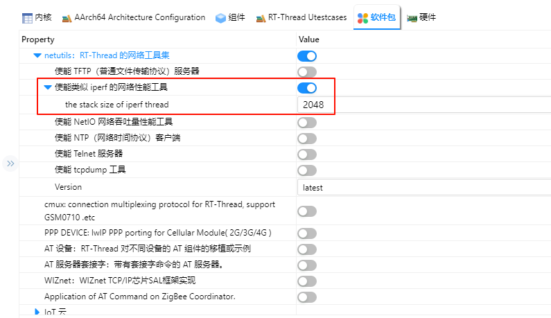
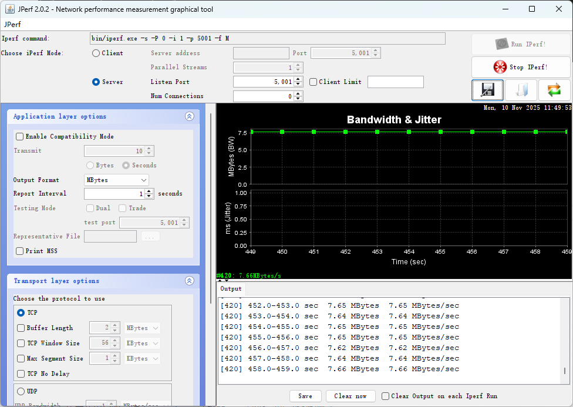

# Ethernet Example

[**Chinese**](README_zh.md) | **English**

## Introduction

This example demonstrates how to use the **Ethernet interface** on **Titan Board Mini**, combined with the **RT-Thread Ethernet driver framework** to implement network communication functions.

Key features include:

- Initialize RA8 series Ethernet hardware
- Configure IP address, subnet mask, and gateway
- Send and receive Ethernet frames
- Integrate RT-Thread `netdev` framework for unified network device management
- Support DMA and interrupts for high-speed data transfer

## Ethernet Overview

### 1. General Introduction

**Ethernet** is the most widely used Local Area Network (LAN) technology, proposed by Xerox PARC in the 1970s and later standardized by IEEE 802.3. Ethernet has the following characteristics:

- **Data transmission method**: Frame-based packet switching, physically transmitted through twisted pair, fiber optic, or wireless media.
- **Topology**: Traditional Ethernet used bus or star topology, while modern Ethernet mainly adopts star and tree topologies.
- **Protocol layer**: Belongs to the data link layer (Layer 2) and physical layer (Layer 1) technologies of the OSI model.

### 2. Ethernet Frame Structure

Ethernet uses **frames** as the unit of data transmission. An Ethernet frame consists of the following fields:

| Field                     | Length          | Description                                    |
| ------------------------- | --------------- | ---------------------------------------------- |
| Preamble                  | 7 bytes         | Used for frame synchronization                 |
| Start Frame Delimiter (SFD) | 1 byte        | Frame start marker, value is 10101011          |
| Destination MAC Address   | 6 bytes         | Receiver hardware address                      |
| Source MAC Address        | 6 bytes         | Transmitter hardware address                   |
| Type/Length               | 2 bytes         | Upper layer protocol type or frame length      |
| Data Payload              | 46~1500 bytes   | Upper layer data (e.g., IP packet)             |
| CRC Checksum              | 4 bytes         | Cyclic redundancy check for frame integrity    |

> **Minimum frame length**: 64 bytes
> **Maximum frame length**: 1518 bytes (without VLAN tag)

## RA8 Series Ethernet Features

RA8 series MCUs (such as RA8P1) integrate high-performance **Ethernet MAC**, supporting RGMII, RMII, and MII interfaces, providing stable and reliable high-speed network communication capabilities. The MAC can work with external PHY and is compatible with the LwIP TCP/IP protocol stack.

### 1. Network Interface Features

1. **Interface Types**
   - **RMII (Reduced Media Independent Interface)**: Pin-saving, supports 10/100 Mbps
   - **MII (Media Independent Interface)**: Standard interface, supports 10/100 Mbps
   - **RGMII (Reduced Gigabit MII)**: Supports 10/100/1000 Mbps, high-speed interface for Gigabit Ethernet
2. **PHY Connection**
   - External PHY connected via MDC/MDIO interface
   - Supports auto-negotiation of speed and duplex mode
   - Can read and write PHY registers for configuration and status monitoring

### 2. MAC Features

1. **Duplex and Speed Support**
   - Full/half duplex
   - Supports 10/100/1000 Mbps (RGMII)
   - Supports auto-negotiation or forced configuration
2. **Frame Processing**
   - VLAN tag support (IEEE 802.1Q, optional)
   - Supports multicast and broadcast frame filtering
   - Hardware CRC generation and verification
3. **MAC Address Management**
   - Supports single or multiple MAC addresses
   - Can be dynamically configured via FSP or software

### 3. DMA and Buffer Features

1. **Independent TX/RX DMA Engines**
   - Supports simultaneous transmission and reception
   - Reduces CPU usage and improves throughput
2. **Descriptor Queues**
   - Configurable number of TX/RX buffers
   - Supports chained DMA for efficient large data transfer
3. **Multi-buffer Management**
   - Supports ring buffers for continuous transmission
   - Reduces packet loss
4. **Hardware Acceleration**
   - Frame filtering, length check, and CRC verification

### 4. Interrupt Mechanism

1. **Interrupt Types**
   - Receive complete (RX)
   - Transmit complete (TX)
   - Error interrupts (CRC error, buffer overflow)
2. **Interrupt Configuration**
   - Priority configurable via FSP
   - Supports RT-Thread ISR integration
3. **Optimization**
   - RX/TX interrupts can work with DMA
   - Selective interrupt enabling for improved performance

### 5. PHY Management

1. **MDIO Interface**
   - Can read/write PHY registers for configuration, reset, and status monitoring
2. **Auto-negotiation**
   - Supports speed (10/100/1000 Mbps) and duplex mode auto-negotiation
3. **Link Monitoring**
   - Detect link status (Up/Down)
   - CRC error and collision detection

### 6. Protocol and Stack Support

1. **TCP/IP Protocol Stack Integration**
   - Compatible with LwIP
   - Supports TCP/UDP/ICMP, DHCP client/server, ARP
2. **Application Layer Support**
   - Supports Telnet, HTTP, MQTT and other applications
   - Multi-thread safe, supports concurrent access

### 7. Performance and Reliability

1. **Throughput Optimization**
   - DMA + interrupts reduce CPU usage
   - Adjustable TX/RX buffer sizes
2. **Reliability Features**
   - Hardware CRC checksum
   - VLAN and multicast filtering reduce interference
   - Link detection and auto-reconnection

## FSP Configuration

>**Note:** This project uses FSP version 6.4.0. Please use FSP 6.4.0 when configuring FSP features.

* Create new r_rmac stack:



* Configure r_mac stack:


* Configure r_layer3_switch:


* Configure r_rmac_phy:



* Configure g_rmac_phy_lsi0:



* ETH0 pin configuration:



* **Note**: All ETH-related pins need to have their drive strength changed to H.



## RT-Thread Settings Configuration

* Enable Ethernet in RT-Thread Settings.



## Software Description

The Ethernet PHY chip initialization function is in `./board/ports/drv_rtl8211.c`:

```c
void rmac_phy_target_rtl8211_initialize (rmac_phy_instance_ctrl_t * phydev)
{
#define RTL_8211F_PAGE_SELECT 0x1F
#define RTL_8211F_EEELCR_ADDR 0x11
#define RTL_8211F_LED_PAGE 0xD04
#define RTL_8211F_LCR_ADDR 0x10

    uint32_t val1, val2 = 0;

    /* switch to led page */
    R_RMAC_PHY_Write(phydev, RTL_8211F_PAGE_SELECT, RTL_8211F_LED_PAGE);

    /* set led1(green) Link 10/100/1000M, and set led2(yellow) Link 10/100/1000M+Active */
    R_RMAC_PHY_Read(phydev, RTL_8211F_LCR_ADDR, &val1);
    val1 |= (1 << 5);
    val1 |= (1 << 8);
    val1 &= (~(1 << 9));
    val1 |= (1 << 10);
    val1 |= (1 << 11);
    R_RMAC_PHY_Write(phydev, RTL_8211F_LCR_ADDR, val1);

    /* set led1(green) EEE LED function disabled so it can keep on when linked */
    R_RMAC_PHY_Read(phydev, RTL_8211F_EEELCR_ADDR, &val2);
    val2 &= (~(1 << 2));
    R_RMAC_PHY_Write(phydev, RTL_8211F_EEELCR_ADDR, val2);

    /* switch back to page0 */
    R_RMAC_PHY_Write(phydev, RTL_8211F_PAGE_SELECT, 0xa42);
}

bool rmac_phy_target_rtl8211_is_support_link_partner_ability (rmac_phy_instance_ctrl_t * p_instance_ctrl,
                                                             uint32_t                   line_speed_duplex)
{
    FSP_PARAMETER_NOT_USED(p_instance_ctrl);
    FSP_PARAMETER_NOT_USED(line_speed_duplex);

    /* This PHY-LSI supports half and full duplex mode. */
    return true;
}
```

## Build & Download

* RT-Thread Studio: Download the Titan Board resource package from the package manager in RT-Thread Studio, then create a new project and build it.


After compilation is complete, connect the development board's USB-DBG interface to the PC, then download the firmware to the development board.

## Running Effect

Insert the network cable into the Ethernet port, press the reset button to restart the development board. After waiting for PHY0 link up, enter `ifconfig` to view the IP address obtained by the development board, then enter `ping baidu.com` command for connectivity testing.



### iperf Test

Open RT-Thread Settings, add the netutils package and enable the iperf tool.



After compilation and download, enter `iperf -c host_IP -p 5001` in the serial terminal for iperf testing.

