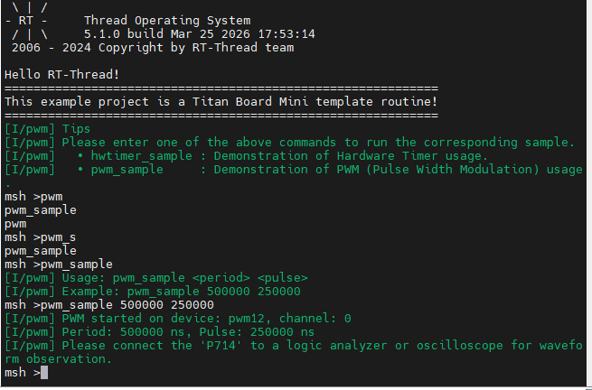
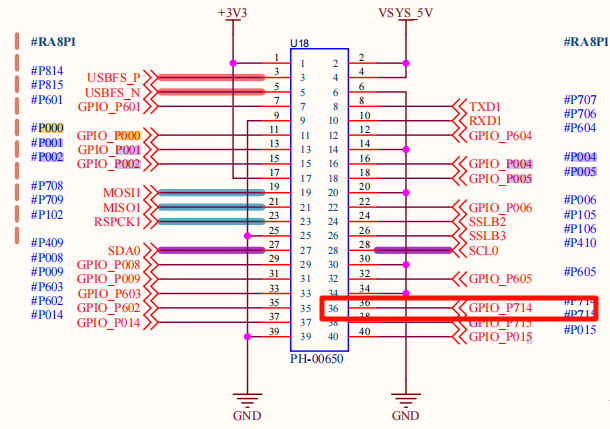
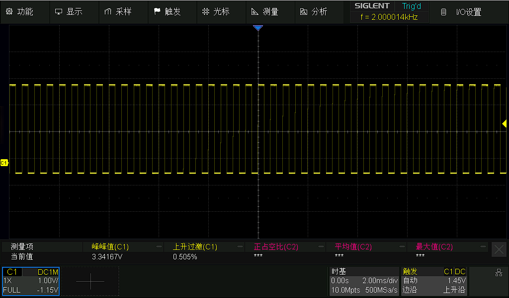

# Titan Mini GPT (General PWM Timer) Driver Example

[**Chinese**](README_zh.md) | **English**

## Introduction

This example project demonstrates how to use the **RT-Thread Timer Device Driver Framework** on **Titan Board Mini (based on RA8P1)** to implement GPT (General PWM Timer) functionality.

### Core Features
- **PWM Waveform Generation**: Supports multiple PWM modes (square wave, triangle wave, etc.)
- **High-Precision Timing**: 32-bit high-resolution counters
- **Multi-Channel Support**: Simultaneously manage multiple timer channels
- **Input Capture**: Measure external signal frequency and pulse width
- **Flexible Configuration**: Supports multiple clock sources and operating modes
- **Real-Time Control**: Microsecond-precision timing control

### Technology Stack
- **Hardware Platform**: Renesas RA8P1 (Cortex-M85 + Cortex-M33)
- **Operating System**: RT-Thread Real-Time Operating System
- **Development Tool**: RT-Thread Studio
- **Driver Framework**: Renesas FSP (Flexible Software Package)

---

## Hardware Introduction

### 1. RA8P1 Microcontroller Features

RA8P1 is Renesas' high-performance 32-bit microcontroller designed for artificial intelligence and machine learning applications:

#### Core Specifications
- **CPU Architecture**: Heterogeneous dual-core architecture
  - **Cortex-M85**: 1GHz main frequency, Helium™ vector extension
  - **Cortex-M33**: 250MHz main frequency, TrustZone security architecture
- **NPU Acceleration**: Integrated Ethos™-55 NPU, 256 GOPS AI computing power
- **Memory Configuration**: 2MB SRAM with ECC support
- **Clock System**: Supports multiple clock sources, up to 1GHz

#### Timer Resources
- **GPT Timers**: Multiple 32-bit general-purpose PWM timers
- **AGT Timers**: Asynchronous 16-bit timers
- **Resolution**: Up to 32-bit counter precision
- **Clock Sources**: PCLK, external trigger, event link control

### 2. GPT Hardware Module Details

#### 2.1 GPT Module Architecture
```
┌─────────────────────────────────────────────────────────┐
│                   GPT Timer Module                       │
├─────────────────────────────────────────────────────────┤
│  Timer Control Unit  │     PWM Compare Unit              │
│  (Timer Control)     │     (PWM Compare)                 │
│                      │                                   │
│  Counter Logic       │     Output Control                │
│  (Counter Logic)     │     (Output Control)              │
│                      │                                   │
│  Input Capture Unit  │     Interrupt Controller          │
│  (Input Capture)     │     (Interrupt Ctrl)              │
│                      │                                   │
│  Clock Select Unit   │     Filter                        │
│  (Clock Select)      │     (Filter)                      │
└─────────────────────────────────────────────────────────┘
```

#### 2.2 GPT Core Features

**Operating Modes**
- **Periodic Mode**: Continuously output fixed-period pulses
- **One-Shot Mode**: Output only one pulse then stop
- **PWM Mode**: Generate PWM waveforms with variable duty cycle
  - Square Wave PWM
  - Saw Wave PWM
  - Triangle Wave PWM

**Performance Specifications**
- **Resolution**: 32-bit counter (0-4,294,967,295)
- **Clock Frequency**: Up to PCLKD/1 (PCLKD supports 100MHz+)
- **Output Precision**: Nanosecond-level precision
- **Channel Count**: Each GPT module supports multiple PWM channels

**Hardware Interfaces**
- **Output Pins**: GTIOCA, GTIOCB (supports polarity control)
- **Input Pins**: Supports external signal triggering and measurement
- **Event Link**: Supports integration with ELC (Event Link Controller)
- **Filter Function**: Supports input signal debouncing filtering

#### 2.3 RA8P1 GPT Actual Configuration

Based on the current project configuration, the GPT configuration for Titan Board Mini is as follows:

**Clock Configuration**
- **Main Clock Source**: PCLKD
- **Division Factor**: Configurable (1-1024)
- **Frequency Range**: Dynamically configured based on system clock

**Pin Assignment**
- **PWM Output**: P714
- **Input Capture**: Supports multiple GPIOs
- **Trigger Source**: External signal or software trigger

---

## Software Architecture

### 1. RT-Thread Device Framework

#### 1.1 Device Hierarchy
```
┌─────────────────────────────────────────────────────────┐
│                  RT-Thread Kernel                        │
├─────────────────────────────────────────────────────────┤
│                Device Management Layer                   │
│  ┌─────────────┐  ┌─────────────┐  ┌─────────────┐    │
│  │  PWM Device │  │  HWTIMER    │  │  Other      │    │
│  │   (pwm12)   │  │  Device     │  │  Devices    │    │
│  └─────────────┘  └─────────────┘  └─────────────┘    │
├─────────────────────────────────────────────────────────┤
│              Driver Abstraction Layer                    │
│  ┌─────────────────────────────────────────────────────┐ │
│  │             GPT Driver Layer                         │ │
│  │  ┌─────────────┐  ┌─────────────┐  ┌─────────────┐ │ │
│  │  │ FSP Adapter │  │ PWM Control │  │ Interrupt   │ │ │
│  │  │  (r_gpt)    │  │ (rt_pwm)    │  │ Handler     │ │ │
│  │  └─────────────┘  └─────────────┘  └─────────────┘ │ │
│  └─────────────────────────────────────────────────────┘ │
├─────────────────────────────────────────────────────────┤
│              Hardware Abstraction Layer                  │
│  ┌─────────────────────────────────────────────────────┐ │
│  │            RA8P1 Hardware Interface                  │ │
│  │  ┌─────────────┐  ┌─────────────┐  ┌─────────────┐ │ │
│  │  │  GPT        │  │ Interrupt   │  │ GPIO        │ │ │
│  │  │  Registers  │  │ Controller  │  │ Control     │ │ │
│  │  │  Interface  │  │    NVIC     │  │    PORT     │ │ │
│  │  └─────────────┘  └─────────────┘  └─────────────┘ │ │
│  └─────────────────────────────────────────────────────┘ │
└─────────────────────────────────────────────────────────┘
```

#### 1.2 Core Interface Functions

**Device Control Interface**
```c
// PWM device lookup
rt_device_pwm *rt_device_find(const char *name);

// PWM configuration setup
rt_err_t rt_pwm_set(rt_device_pwm *device, int channel,
                   rt_uint32_t period, rt_uint32_t pulse);

// PWM enable control
rt_err_t rt_pwm_enable(rt_device_pwm *device, int channel);
rt_err_t rt_pwm_disable(rt_device_pwm *device, int channel);

// HWTIMER interface
rt_err_t rt_device_find(const char *name);
rt_err_t rt_hwtimer_control(rt_device_t dev, int cmd, void *arg);
```

**Interrupt Handler Interface**
```c
// GPT interrupt service routine
void timer1_callback(timer_callback_args_t *p_args);

// Interrupt configuration
void R_GPT_Open(gpt_instance_ctrl_t *p_ctrl, const timer_cfg_t *const p_cfg);
void R_GPT_Start(gpt_instance_ctrl_t *p_ctrl);
void R_GPT_Stop(gpt_instance_ctrl_t *p_ctrl);
```

### 2. Driver Architecture

#### 2.1 Main Driver Files

```
project/Titan_Mini_driver_gpt/
├── src/hal_entry.c              # Main program entry
├── ra/src/r_gpt/r_gpt.c         # FSP GPT driver implementation
├── ra/inc/instances/r_gpt.h     # GPT header file
├── ra_cfg/fsp_cfg/r_gpt_cfg.h   # GPT configuration file
└── ra_gen/hal_data.h            # Hardware abstraction layer
```

---

## Usage Examples

## Configuration Instructions

## Running Effect Example

Enter pwm_sample 500000 250000 in the terminal to run the example



Then connect the P714 pin to an oscilloscope to see the effect, as shown below





---

If you have any questions or suggestions, please feel free to discuss them in the [RT-Thread Official Forum](https://forum.rt-thread.org/).
