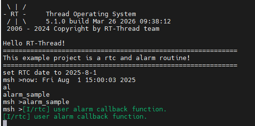

# RTC Driver Example Guide

[**Chinese**](README_zh.md) | **English**

## Introduction

This example demonstrates how to use the **RT-Thread RTC Device Driver Framework** on **Titan Board Mini** to drive the Real-Time Clock peripheral of the RA8P1 microcontroller. RTC (Real-Time Clock) is an important hardware peripheral that can maintain time information even when the main power is disconnected, providing a reliable time reference for the system.

### Main Features

- **RA8P1 RTC hardware initialization**
- **Date and time setting and reading**
- **Alarm function configuration**
- **Battery backup support**
- **LED indicator status display**

## Hardware Introduction - RA8P1 RTC Features

### 1. Overview

RA8P1 is a high-performance microcontroller launched by Renesas Electronics, integrating multiple advanced peripherals. Its RTC module is a complete real-time clock system with full calendar functionality and low-power characteristics.

### 2. RA8P1 RTC Main Features

#### 2.1 Core Functions
- **Calendar Function**: Supports complete time calculation for year, month, date, hour, minute, and second
- **Clock Source**: 32.768kHz crystal oscillator as the clock source, providing precise time reference
- **Low-power Operation**: Supports low-power mode, can run for a long time under battery power
- **Battery Backup**: Supports VBATT battery backup function, maintains time information after main power is disconnected

#### 2.2 Alarm Function
- **Programmable Alarm**: Supports setting multiple alarm events
- **Multiple Trigger Modes**:
  - Per-second trigger
  - Per-minute trigger
  - Per-hour trigger
  - Daily trigger
  - Weekly trigger
  - Monthly trigger
  - Yearly trigger

#### 2.3 Advanced Features
- **Automatic Leap Year Compensation**: Automatically handles leap year calculation
- **2000-2099 Calendar**: Supports 100-year calendar range (2000-2099)
- **Temperature Compensation**: Optional temperature compensation function to improve time accuracy
- **Event Link Controller**: Supports event link triggering with peripherals

#### 2.4 Hardware Support
- **VBATT Pin**: Dedicated battery backup pin, supports external battery power supply
- **32.768kHz Crystal Oscillator**: Built-in sub-clock oscillator
- **Backup Registers**: Provides data backup function
- **Tamper Detection**: Supports up to 3 tamper detection pins

#### 2.5 Power Management
- **Multiple Power Modes**:
  - Normal mode
  - Low-power mode
  - Deep sleep mode
- **Voltage Detection**: Programmable voltage detection (PVD) function
- **Watchdog**: Dual watchdog timer

### 3. RA8P1 RTC Technical Parameters

| Parameter | Value | Description |
|-----------|-------|-------------|
| **Clock Accuracy** | ±5ppm | 32.768kHz crystal oscillator accuracy |
| **Calendar Range** | 2000-2099 | Supports 100-year calendar |
| **Time Format** | 24-hour format | Supports hour:minute:second |
| **Leap Year Handling** | Automatic | Automatic leap year calculation |
| **Operating Voltage** | 1.62-3.6V | Wide voltage range |
| **Temperature Range** | -40°C ~ +105°C | Industrial-grade temperature range |
| **Backup Power** | 3.3V | Supports VBATT battery backup |

## Software Architecture - RT-Thread RTC Device Framework

### 1. RT-Thread Device Architecture

RT-Thread adopts a layered device management architecture:

```
Application Layer
├── I/O Device Management Layer
├── Device Driver Framework Layer
└── Device Driver Layer
    └── RA8P1 RTC Hardware Abstraction Layer
```

### 2. RTC Device Type

In RT-Thread, RTC belongs to device type `RT_Device_Class_RTC`:

```c
enum rt_device_class_type {
    RT_Device_Class_Char,    // Character device
    RT_Device_Class_Block,   // Block device
    RT_Device_Class_NetIf,   // Network interface device
    RT_Device_Class_MTD,     // Memory device
    RT_Device_Class_RTC,     // RTC device
    RT_Device_Class_Sound,   // Sound device
    RT_Device_Class_Graphic, // Graphic device
    // ...
};
```

### 3. Device Management Interface

#### 3.1 Device Finding
```c
rt_device_t rt_device_find(const char* name);
```

#### 3.2 Device Operations
```c
rt_err_t rt_device_open(rt_device_t dev, rt_uint16_t oflag);
rt_err_t rt_device_close(rt_device_t dev);
rt_size_t rt_device_read(rt_device_t dev, rt_off_t pos, void *buffer, rt_size_t size);
rt_size_t rt_device_write(rt_device_t dev, rt_off_t pos, const void *buffer, rt_size_t size);
rt_err_t rt_device_control(rt_device_t dev, rt_uint8_t cmd, void *arg);
```

### 4. RT-Thread RTC API

#### 4.1 Time Operation API

```c
// Set date
rt_err_t set_date(rt_uint32_t year, rt_uint32_t month, rt_uint32_t day);

// Set time
rt_err_t set_time(rt_uint32_t hour, rt_uint32_t minute, rt_uint32_t second);

// Get current time
time_t time(time_t *t);
```

#### 4.2 Timestamp Operation

```c
// Get timestamp
time_t get_timestamp(time_t *timestamp);

// Convert timestamp to local time
void gmtime_r(const time_t *timep, struct tm *result);
```

#### 4.3 Alarm API

```c
// Alarm callback function
typedef void (*rt_alarm_callback)(rt_alarm_t alarm, time_t timestamp);

// Create alarm
rt_alarm_t rt_alarm_create(rt_alarm_callback callback, struct rt_alarm_setup *setup);

// Start alarm
rt_err_t rt_alarm_start(rt_alarm_t alarm);

// Stop alarm
rt_err_t rt_alarm_stop(rt_alarm_t alarm);

// Delete alarm
rt_err_t rt_alarm_delete(rt_alarm_t alarm);
```

## Usage Example

### 1. Time Setting and Reading

#### 1.1 Basic Time Setting

```c
#include <rtthread.h>
#include <rtdevice.h>

void hal_entry(void)
{
    rt_err_t ret = RT_EOK;
    time_t now;
    rt_device_t device = rt_device_find("rtc");

    if (!device) {
        rt_kprintf("Failed to find RTC device!\n");
        return;
    }

    // Open device
    ret = rt_device_open(device, 0);
    if (ret != RT_EOK) {
        rt_kprintf("Failed to open RTC device!\n");
        return;
    }

    // Set date (August 1, 2025)
    ret = set_date(2025, 8, 1);
    if (ret != RT_EOK) {
        rt_kprintf("Failed to set RTC date\n");
        return;
    }
    rt_kprintf("Set RTC date to 2025-8-1\n");

    // Set time (15:00:00)
    ret = set_time(15, 00, 00);
    if (ret != RT_EOK) {
        rt_kprintf("Failed to set RTC time\n");
        return;
    }
    rt_kprintf("Set RTC time to 15:00:00\n");

    // Delay for 3 seconds
    rt_thread_mdelay(3000);

    // Get current timestamp
    get_timestamp(&now);
    rt_kprintf("Current time: %.*s", 25, ctime(&now));
}
```

#### 1.2 Advanced Time Operation

```c
// Get complete time information
void get_full_time_info(void)
{
    time_t now;
    struct tm *timeinfo;

    // Get current timestamp
    now = time(NULL);

    // Convert to local time
    timeinfo = localtime(&now);

    rt_kprintf("Current time information:\n");
    rt_kprintf("Year: %d\n", timeinfo->tm_year + 1900);
    rt_kprintf("Month: %d\n", timeinfo->tm_mon + 1);
    rt_kprintf("Day: %d\n", timeinfo->tm_mday);
    rt_kprintf("Hour: %d\n", timeinfo->tm_hour);
    rt_kprintf("Minute: %d\n", timeinfo->tm_min);
    rt_kprintf("Second: %d\n", timeinfo->tm_sec);
    rt_kprintf("Day of week: %d\n", timeinfo->tm_wday);
    rt_kprintf("Day of year: %d\n", timeinfo->tm_yday);
    rt_kprintf("Daylight saving time flag: %d\n", timeinfo->tm_isdst);
}
```

### 2. Alarm Configuration

#### 2.1 Alarm Callback Function

```c
void user_alarm_callback(rt_alarm_t alarm, time_t timestamp)
{
    rt_kprintf("Alarm triggered! Time: %.*s", 25, ctime(&timestamp));

    struct rt_alarm_setup *setup = (struct rt_alarm_setup *)alarm->user_data;
    if (setup->flag == RT_ALARM_SECOND) {
        rt_kprintf("Per-second alarm triggered\n");
    } else if (setup->flag == RT_ALARM_MINUTE) {
        rt_kprintf("Per-minute alarm triggered\n");
    }
}
```

#### 2.2 Alarm Example Configuration

```c
// Alarm example function
void alarm_sample(void)
{
    rt_device_t dev = rt_device_find("rtc");
    struct rt_alarm_setup setup;
    struct rt_alarm *alarm = RT_NULL;
    static time_t now;
    struct tm p_tm;

    // Get current timestamp
    now = get_timestamp(NULL);

    // Set alarm time to next second
    now += 1;
    gmtime_r(&now, &p_tm);

    // Configure alarm parameters
    setup.flag = RT_ALARM_SECOND;  // Trigger every second
    setup.wktime.tm_year = p_tm.tm_year;
    setup.wktime.tm_mon = p_tm.tm_mon;
    setup.wktime.tm_mday = p_tm.tm_mday;
    setup.wktime.tm_wday = p_tm.tm_wday;
    setup.wktime.tm_hour = p_tm.tm_hour;
    setup.wktime.tm_min = p_tm.tm_min;
    setup.wktime.tm_sec = p_tm.tm_sec;

    // Create alarm
    alarm = rt_alarm_create(user_alarm_callback, &setup);
    if (alarm != RT_NULL) {
        rt_alarm_start(alarm);
        rt_kprintf("Alarm created and started successfully\n");
    }
}
```

## Configuration Instructions


## Running Effect Example

### 1. Console Output

After compiling and flashing the program, power on and run `alarm_sample` in the terminal to see the effect


