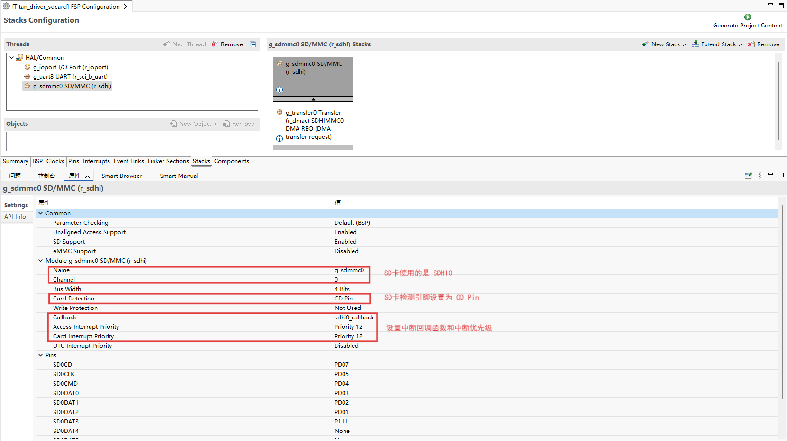
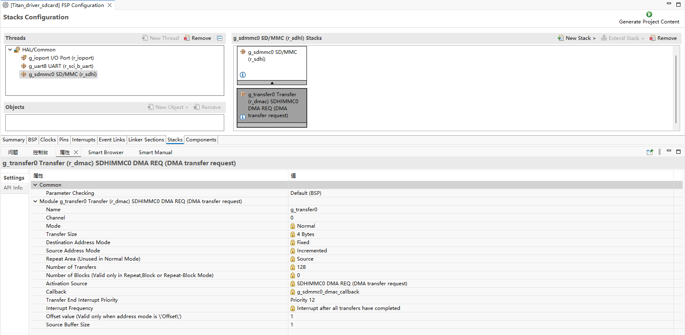
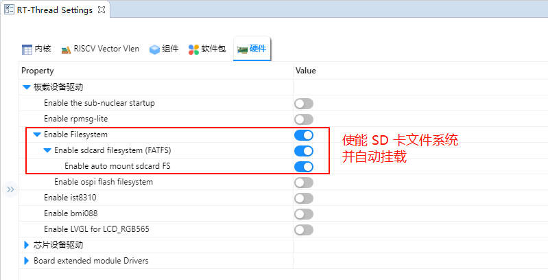
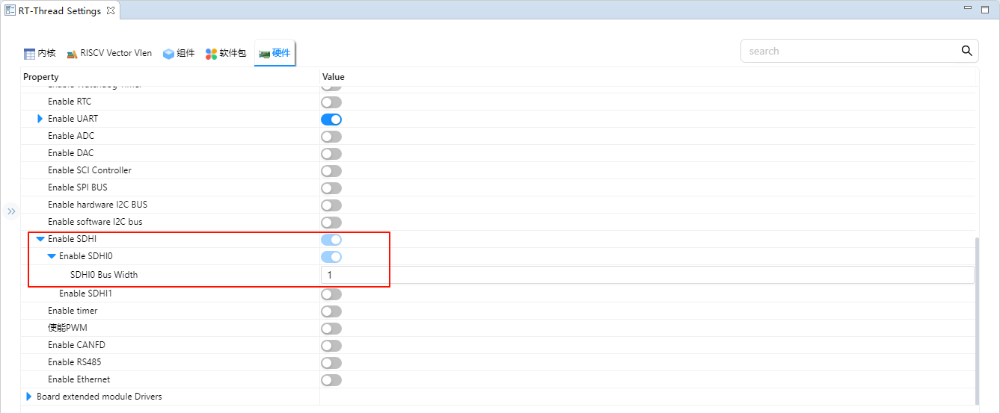
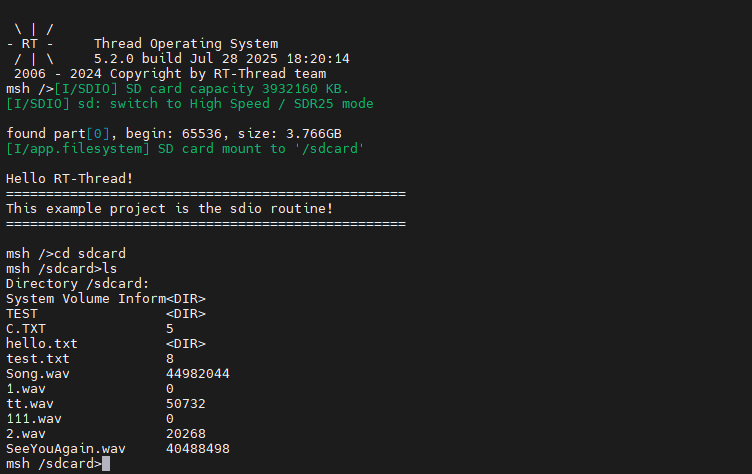

# SD卡文件系统使用说明

**中文**|[**English**](README.md)

## 简介

本例程使用 SD 卡作为文件系统的存储设备，展示如何在  SD 卡上创建文件系统（格式化卡），并挂载文件系统到 RT-Thread 操作系统中。

文件系统挂载成功后，展示如何使用文件系统提供的功能对目录和文件进行操作。

## SD 卡简介

### 1. 概述

**SD 卡（Secure Digital Card）** 是一种小型、便携的非易失性存储设备，广泛用于 **嵌入式系统、相机、手机、数据记录仪** 等场景。

SD 卡由 **控制器 + NAND Flash 存储芯片** 组成，外部通过标准接口与主机通信。

主要特点：

- 小巧轻便，体积通常为 **32 × 24 × 2.1 mm**（标准卡）
- 采用 **非易失性闪存（NAND Flash）** 存储数据
- 支持热插拔和掉电保护

### 2. SD 卡类型

1. **按尺寸分类**

   - **标准 SD 卡（Standard SD）**：32 × 24 mm
   - **Mini SD**：21.5 × 20 mm
   - **Micro SD（TF 卡）**：15 × 11 mm，最常用

2. **按容量分类**

   | 类型 | 容量范围      |
   | ---- | ------------- |
   | SDSC | 1 MB ~ 2 GB   |
   | SDHC | 4 GB ~ 32 GB  |
   | SDXC | 32 GB ~ 2 TB  |
   | SDUC | 2 TB ~ 128 TB |

3. **按速度等级**

   - **Class 2/4/6/10**：最低写入速度分别为 2、4、6、10 MB/s
   - **UHS（Ultra High Speed）**：UHS-I/UHS-II/UHS-III，速率可达 **312 MB/s**
   - **Video Speed Class（V6/V10/V30/V60/V90）**：适用于高清视频录制

### 3. SD 卡接口

1. **SPI 模式**
   - 使用 SPI 总线（MISO, MOSI, SCK, CS）
   - 简单易用，适合 MCU
   - 数据传输速率较低
2. **SD 模式（1-bit / 4-bit）**
   - 使用专用 SD 总线
   - 支持 1-bit 或 4-bit 数据线
   - 速率高于 SPI 模式
3. **UHS 模式**
   - 支持高速数据传输，常用于摄像机和高性能嵌入式应用

### 4. 工作原理

1. **命令/数据传输**
   - 主机通过 SD 卡协议发送命令（CMD）
   - 卡片返回响应（R1, R2 等）
   - 读写数据块（Block），每块通常为 **512 Byte**
2. **控制器管理**
   - 内部控制器负责 **坏块管理、错误纠正（ECC）、逻辑到物理地址映射**
   - 外部主机无需直接管理 NAND Flash 特性
3. **数据存储**
   - 数据存储在 NAND Flash 中
   - 支持多次擦写和擦写寿命管理（典型寿命 10 万次擦写）

### 5. SD 卡性能指标

| 参数         | 描述                                 |
| ------------ | ------------------------------------ |
| 容量         | 1 GB ~ 128 TB                        |
| 数据块大小   | 512 Byte（标准）                     |
| 接口速率     | SPI/SD 1-bit/4-bit/UHS               |
| 最大传输速度 | 25 MB/s（标准），312 MB/s（UHS-III） |
| 工作电压     | 3.3 V（部分 Micro SD 支持 1.8 V）    |
| 工作温度     | -25 ℃ ~ 85 ℃（工业级）               |
| 耐用性       | 擦写次数 10^4 ~ 10^5                 |

### 6. SD 卡应用场景

1. **消费电子**
   - 手机、平板、数码相机、摄像机存储
2. **嵌入式系统**
   - MCU/FPGA 数据存储
   - 日志记录、配置文件保存
3. **工业应用**
   - 工业控制器、数据采集系统
   - 高温环境工业级 SD 卡可使用
4. **音视频应用**
   - 高速视频录制（UHS/V Class）
5. **汽车电子**
   - 行车记录仪、导航系统数据存储

## RA8 系列 SDHI 模块概述

RA8 系列 MCU 内置高性能 SDHI 模块，专门用于与 SD/SDHC/SDXC 卡高速通信，支持 SPI 模式和 SD/SDIO 模式。

### 1. 总体特性

- **支持 SD 标准**
  - SD v1.x / v2.x / SDHC / SDXC
  - 支持 SPI 模式和 SD/MMC 模式
- **高速数据传输**
  - 最高可达 50 MHz SDCLK（具体取决于 MCU 时钟配置）
  - 支持 1-bit/4-bit 数据总线
- **自动命令和数据传输**
  - 支持 DMA 传输模式，减少 CPU 占用
  - 自动命令序列生成（CMD0~CMD59）
- **错误检测**
  - CRC7 校验命令，CRC16 校验数据
  - 超时检测，响应错误识别
- **中断支持**
  - 卡插拔检测中断
  - 命令完成中断
  - 数据传输完成中断
  - 错误中断

### 2. SDHI 模块架构

RA8 SDHI 模块主要包含以下子模块：

1. **命令控制单元（Command Control Unit）**
   - 负责发送 SD 命令（CMD0~CMD59）
   - 处理命令响应（R1、R2、R3、R7 等）
   - 支持命令超时检测和 CRC 校验
2. **数据传输单元（Data Transfer Unit）**
   - 通过内部 FIFO 或 DMA 实现数据收发
   - 支持块读/写，最大 512 字节块
   - 支持单块/多块传输模式
3. **时钟与总线控制**
   - SDCLK 生成和分频
   - 1-bit 或 4-bit 总线切换
   - 可配置高/低电平保持时间
4. **卡检测与电源控制**
   - 检测 SD 卡插入/拔出状态
   - 可控制卡片电源开关（如支持）
5. **中断与事件控制单元**
   - 命令完成中断
   - 数据传输完成中断
   - 错误中断
   - 卡插拔中断

### 3. SDHI 工作原理

1. **初始化阶段**
   - 检测 SD 卡插入
   - 发送 CMD0、CMD8 初始化卡
   - 查询卡容量与版本信息
2. **命令发送**
   - Host 向卡发送命令
   - Card 返回响应，SDHI 模块验证 CRC 并触发中断
3. **数据传输**
   - 读/写数据块时，通过 FIFO 或 DMA 进行高速传输
   - 支持单块或多块操作
4. **错误处理**
   - 超时、CRC 错误、响应错误等
   - SDHI 模块可触发错误中断，由驱动进行重试或异常处理

## FSP 配置

* 新建 stacks 选择 r_sdhi 并配置 sdhi0 配置信息如下：





## RT-Thread Settings 配置

* 在配置中使能 SD 卡文件系统。



* 使能 SDHI0 并将 SDHI0 的 Bus Width 设置为 1。



## 示例工程说明

本例程的文件系统初始化可参考下方代码示例（可放入 `board` 层或应用初始化文件中）：

```c
#include <rtthread.h>

#if defined(BSP_USING_FILESYSTEM)
#include <dfs_romfs.h>
#include <dfs_fs.h>
#include <dfs_file.h>

#if DFS_FILESYSTEMS_MAX < 4
#error "Please define DFS_FILESYSTEMS_MAX more than 4"
#endif
#if DFS_FILESYSTEM_TYPES_MAX < 4
#error "Please define DFS_FILESYSTEM_TYPES_MAX more than 4"
#endif

#define DBG_TAG "app.filesystem"
#define DBG_LVL DBG_INFO
#include <rtdbg.h>

#ifdef BSP_USING_FS_AUTO_MOUNT
#ifdef BSP_USING_SDCARD_FATFS
static int onboard_sdcard_mount(void)
{
    if (dfs_mount("sd", "/sdcard", "elm", 0, 0) == RT_EOK)
    {
        LOG_I("SD card mount to '/sdcard'");
    }
    else
    {
        LOG_E("SD card mount to '/sdcard' failed!");
        rt_pin_write(0x000D, PIN_LOW);
    }

    return RT_EOK;
}
#endif /* BSP_USING_SDCARD_FATFS */
#endif /* BSP_USING_FS_AUTO_MOUNT */

#ifdef BSP_USING_FLASH_FS_AUTO_MOUNT
#ifdef BSP_USING_FLASH_FATFS
#define FS_PARTITION_NAME "filesystem"

static int onboard_fal_mount(void)
{
    /* 初始化 fal 功能 */
    extern int fal_init(void);
    extern struct rt_device* fal_mtd_nor_device_create(const char *parition_name);
    fal_init ();
    /* 在 ospi flash 中名为 "filesystem" 的分区上创建一个块设备 */
    struct rt_device *mtd_dev = fal_mtd_nor_device_create (FS_PARTITION_NAME);
    if (mtd_dev == NULL)
    {
        LOG_E("Can't create a mtd device on '%s' partition.", FS_PARTITION_NAME);
        return -RT_ERROR;
    }
    else
    {
        LOG_D("Create a mtd device on the %s partition of flash successful.", FS_PARTITION_NAME);
    }

    /* 挂载 ospi flash 中名为 "filesystem" 的分区上的文件系统 */
    if (dfs_mount (FS_PARTITION_NAME, "/fal", "lfs", 0, 0) == 0)
    {
        LOG_I("Filesystem initialized!");
    }
    else
    {
        dfs_mkfs ("lfs", FS_PARTITION_NAME);
        if (dfs_mount ("filesystem", "/fal", "lfs", 0, 0) == 0)
        {
            LOG_I("Filesystem initialized!");
        }
        else
        {
            LOG_E("Failed to initialize filesystem!");
            rt_pin_write(0x000D, PIN_LOW);
        }
    }

    return RT_EOK;
}
#endif /*BSP_USING_FLASH_FATFS*/
#endif /*BSP_USING_FLASH_FS_AUTO_MOUNT*/

const struct romfs_dirent _romfs_root[] =
{
#ifdef BSP_USING_SDCARD_FATFS
    {ROMFS_DIRENT_DIR, "sdcard", RT_NULL, 0},
#endif

#ifdef BSP_USING_FLASH_FATFS
  { ROMFS_DIRENT_DIR, "fal", RT_NULL, 0 },
#endif
        };

const struct romfs_dirent romfs_root =
{
ROMFS_DIRENT_DIR, "/", (rt_uint8_t*) _romfs_root, sizeof(_romfs_root) / sizeof(_romfs_root[0])
};

static int filesystem_mount(void)
{

#ifdef RT_USING_DFS_ROMFS
    if (dfs_mount(RT_NULL, "/", "rom", 0, &(romfs_root)) != 0)
    {
        LOG_E("rom mount to '/' failed!");
    }

    /* 确保块设备注册成功之后再挂载文件系统 */
    rt_thread_delay(500);
#endif
#ifdef BSP_USING_FS_AUTO_MOUNT
    onboard_sdcard_mount();
#endif /* BSP_USING_FS_AUTO_MOUNT */

#ifdef BSP_USING_FLASH_FS_AUTO_MOUNT
    onboard_fal_mount ();
#endif

    return RT_EOK;
}
INIT_COMPONENT_EXPORT(filesystem_mount);
#endif /* defined(BSP_USING_FILESYSTEM)*/
```

## 编译&下载

* RT-Thread Studio：在RT-Thread Studio 的包管理器中下载 Titan Board 资源包，然后创建新工程，执行编译。

编译完成后，将开发板的 USB-DBG 接口与PC 机连接，然后将固件下载至开发板。

##  运行效果

按下复位按键重启开发板，等待 SD 挂载后进入 SD 卡文件系统目录查看 SD 卡上的文件。


