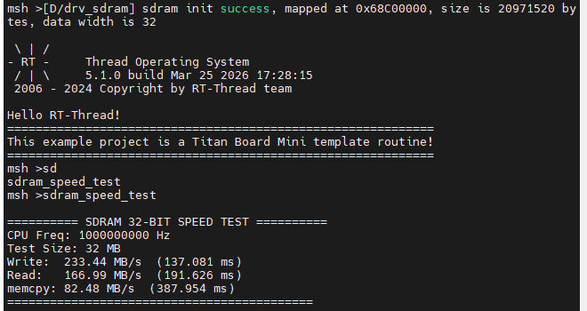

# Titan Board Mini SDRAM 驱动开发指南

**中文** | [**English**](README.md)

## 项目概述

本项目为 **Titan Board Mini** 平台提供了完整的 SDRAM 驱动解决方案，基于 Renesas RA8P1 微控制器和 RT-Thread 实时操作系统。该驱动充分利用了 RA8P1 的外部存储器接口，为嵌入式系统提供高性能的外部内存访问能力。

### 主要特性

- **大容量存储**: 支持 64MB SDRAM 外部存储
- **高性能访问**: 32位数据总线，高频运行能力
- **实时系统支持**: 完全兼容 RT-Thread 内存管理框架
- **完整功能**: 支持初始化、测试、性能评估等完整功能
- **易于使用**: 提供命令行接口，方便开发调试

### 技术架构

```
用户应用层
    ↓
RT-Thread 内存管理层
    ↓
BSP SDRAM 驱动层
    ↓
RA8P1 SDRAMC 硬件控制器
    ↓
物理 SDRAM 芯片
```

---

## 硬件介绍

### 2.1 RA8P1 外部存储器接口特性

RA8P1 微控制器集成了强大的外部存储器接口，专门用于连接 SDRAM 芯片。主要特性包括：

#### 控制器特性
- **SDRAM 控制器 (SDRAMC)**: 专用硬件控制器，支持 SDRAM 操作时序管理
- **地址/数据复用**: 支持地址线和数据线的时分复用
- **32位数据总线**: 高吞吐量数据传输
- **自动刷新**: 内置自动刷新机制，确保数据完整性
- **低功耗模式**: 支持自刷新模式，降低功耗

#### 时序控制
- **可编程时序**: 支持多种 CAS 延迟设置 (CL2, CL3, CL4)
- **灵活的行/列访问**: 可配置行预充、行激活时间
- **刷新周期**: 可编程自动刷新间隔
- **突发长度**: 支持 1、2、4、8 位的突发传输

#### 内存映射
```c
#define SDRAM_BASE_ADDR    (0x68000000UL)  // SDRAM 起始地址
#define SDRAM_SIZE         (64 * 1024 * 1024UL) // 64MB 大小
// 访问范围: 0x68000000 - 0x68FFFFFF
```

### 2.2 SDRAM 类型支持

当前系统支持的 SDRAM 配置：

#### 芯片规格
- **容量**: 64MB (256Mbit)
- **数据宽度**: 32位
- **组织结构**: 4banks × 4M × 32bit
- **工作电压**: 3.3V
- **访问时间**: 标准同步 SDRAM

#### 时序参数
```c
// 关键时序参数
#define BSP_CFG_SDRAM_TRAS  (6)    // 行激活到预充时间
#define BSP_CFG_SDRAM_TRCD  (3)    // 行激活到列访问时间
#define BSP_CFG_SDRAM_TRP   (3)    // 预充时间
#define BSP_CFG_SDRAM_TWR   (2)    // 写恢复时间
#define BSP_CFG_SDRAM_TCL   (3)    // CAS 延迟
#define BSP_CFG_SDRAM_TRFC  (937)  // 刷新周期
#define BSP_CFG_SDRAM_TREFW (8)    // 刷新等待时间
```

### 2.3 硬件连接说明

SDRAM 芯片通过以下信号线连接到 RA8P1：

#### 数据总线
- `DQ[31:0]`: 32位双向数据线
- `DQM[3:0]`: 数据掩码信号

#### 地址总线
- `A[12:0]`: 地址线 (复用数据线)
- `BA[1:0]`: Bank 地址选择

#### 控制信号
- `RAS#`: 行地址选通
- `CAS#`: 列地址选通
- `WE#`: 写使能
- `CS#`: 片选信号
- `CKE`: 时钟使能
- `CLK`: 时钟信号

#### 电源和地线
- `VDD/VSS`: 电源和地线
- `VDDQ/VSSQ`: 数据电源和地线

---

## 软件架构

### 3.1 SDRAM 驱动初始化流程

SDRAM 初始化遵循标准 JEDEC 规范，主要步骤如下：

#### 初始化序列
```c
void R_BSP_SdramInit(bool init_memory)
{
    // 1. 检查状态寄存器
    while (R_BUS->SDRAM.SDSR) {
        // 等待状态寄存器清零
    }

    // 2. 设置初始化参数
    R_BUS->SDRAM.SDIR = ((BSP_CFG_SDRAM_INIT_ARFI - 3U) << R_BUS_SDRAM_SDIR_ARFI_Pos) |
                        (BSP_CFG_SDRAM_INIT_ARFC << R_BUS_SDRAM_SDIR_ARFC_Pos) |
                        ((BSP_CFG_SDRAM_INIT_PRC - 3U) << R_BUS_SDRAM_SDIR_PRC_Pos);

    // 3. 设置总线宽度
    R_BUS->SDRAM.SDCCR = (BSP_CFG_SDRAM_BUS_WIDTH << R_BUS_SDRAM_SDCCR_BSIZE_Pos);

    // 4. 启动时钟输出
    R_BSP_RegisterProtectDisable(BSP_REG_PROTECT_CGC);
    R_SYSTEM->SDCKOCR = 1;
    R_BSP_RegisterProtectEnable(BSP_REG_PROTECT_CGC);

    // 5. 执行初始化序列
    R_BUS->SDRAM.SDICR = 1U;
    while (R_BUS->SDRAM.SDSR_b.INIST) {
        // 等待初始化完成
    }

    // 6. 设置访问模式
    R_BUS->SDRAM.SDAMOD = BSP_CFG_SDRAM_ACCESS_MODE;
    R_BUS->SDRAM.SDCMOD = BSP_CFG_SDRAM_ENDIAN_MODE;

    // 7. 配置模式寄存器
    R_BUS->SDRAM.SDMOD = (BSP_PRV_SDRAM_MR_WB_SINGLE_LOC_ACC << 9) |
                         (BSP_PRV_SDRAM_MR_OP_MODE << 7) |
                         (BSP_CFG_SDRAM_TCL << 4) |
                         (BSP_PRV_SDRAM_MR_BT_SEQUENTIAL << 3) |
                         (BSP_PRV_SDRAM_MR_BURST_LENGTH << 0);

    // 8. 设置时序参数
    R_BUS->SDRAM.SDTR = ((BSP_CFG_SDRAM_TRAS - 1U) << R_BUS_SDRAM_SDTR_RAS_Pos) |
                        ((BSP_CFG_SDRAM_TRCD - 1U) << R_BUS_SDRAM_SDTR_RCD_Pos) |
                        ((BSP_CFG_SDRAM_TRP - 1U) << R_BUS_SDRAM_SDTR_RP_Pos) |
                        ((BSP_CFG_SDRAM_TWR - 1U) << R_BUS_SDRAM_SDTR_WR_Pos) |
                        (BSP_CFG_SDRAM_TCL << R_BUS_SDRAM_SDTR_CL_Pos);

    // 9. 设置地址偏移
    R_BUS->SDRAM.SDADR = BSP_CFG_SDRAM_MULTIPLEX_ADDR_SHIFT;

    // 10. 配置自动刷新
    R_BUS->SDRAM.SDRFCR = ((BSP_CFG_SDRAM_TREFW - 1U) << R_BUS_SDRAM_SDRFCR_REFW_Pos) |
                          ((BSP_CFG_SDRAM_TRFC - 1U) << R_BUS_SDRAM_SDRFCR_RFC_Pos);

    // 11. 启动自动刷新
    R_BUS->SDRAM.SDRFEN = 1U;

    // 12. 启用 SDRAM 访问
    R_BUS->SDRAM.SDCCR = R_BUS_SDRAM_SDCCR_EXENB_Msk |
                         (BSP_CFG_SDRAM_BUS_WIDTH << R_BUS_SDRAM_SDCCR_BSIZE_POS);
}
```

#### 关键步骤说明

1. **状态检查**: 确保 SDRAM 处于就绪状态
2. **初始化参数**: 配置行刷新、预充电等基本参数
3. **时钟配置**: 启动 SDRAM 时钟信号
4. **初始化执行**: 执行标准的 SDRAM 初始化序列
5. **访问模式**: 设置连续访问模式和字节序
6. **模式寄存器**: 配置 CAS 延迟、突发长度等参数
7. **时序配置**: 设置所有关键时序参数
8. **地址配置**: 配置地址复用模式
9. **刷新配置**: 设置自动刷新参数
10. **启动刷新**: 开始自动刷新操作
11. **启用访问**: 允许 CPU 访问 SDRAM

### 3.2 内存管理机制

#### 内存分配策略
- **连续内存池**: 使用固定大小的内存块
- **对齐要求**: 32位数据总线要求 4 字节对齐
- **缓存优化**: 支持 DMA 直接访问

#### RT-Thread 集成
默认情况下 RT-Thread 的 heap 位于片上 SRAM，无法直接 `rt_malloc()` 64MB 这样的大块内存。推荐的做法是在 SDRAM 区域上创建独立的 memheap 或者使用静态缓冲区配合 `BSP_PLACE_IN_SECTION(".sdram")` 属性。下面的示例演示了如何创建一个名为 `sdram` 的 memheap：

```c
#define SDRAM_POOL_SIZE   (4 * 1024 * 1024)  // 根据需求调整
static uint8_t sdram_pool[SDRAM_POOL_SIZE] BSP_PLACE_IN_SECTION(".sdram");
static struct rt_memheap sdram_heap;

void sdram_heap_init(void)
{
    rt_memheap_init(&sdram_heap, "sdram", sdram_pool, sizeof(sdram_pool));
}

void example_use(void)
{
    void *sdram_buffer = rt_memheap_alloc(&sdram_heap, 512 * 1024);
    if (sdram_buffer)
    {
        rt_memcpy(sdram_buffer, src_data, 512 * 1024);
        rt_memheap_free(sdram_buffer);
    }
}
```

#### 数据完整性保护
- **初始化验证**: 在每次使用前进行基本测试
- **运行时监测**: 支持内存访问错误检测
- **错误恢复**: 提供错误处理机制

### 3.3 BSP 层封装

#### BSP 接口函数
```c
// SDRAM 初始化
R_BSP_SdramInit(true);

// 自刷新模式切换
R_BSP_SdramSelfRefreshEnable();  // 进入自刷新
R_BSP_SdramSelfRefreshDisable(); // 退出自刷新
```

#### 硬件抽象层
- **寄存器映射**: 统一的寄存器访问接口
- **时序配置**: 可配置的时序参数
- **状态监控**: 实时状态查询功能

---

## 使用示例

### 4.1 基础读写操作

#### 内存映射访问
```c
// SDRAM 基础访问示例
void basic_sdram_access(void)
{
    uint32_t *sdram_ptr = (uint32_t *)SDRAM_BASE_ADDR;
    uint32_t i;

    // 写入测试数据
    for (i = 0; i < 1024; i++) {
        sdram_ptr[i] = 0xA5A5A5A5 + i;
    }

    // 读取并验证
    for (i = 0; i < 1024; i++) {
        uint32_t read_data = sdram_ptr[i];
        uint32_t expected = 0xA5A5A5A5 + i;

        if (read_data != expected) {
            rt_kprintf("Error at offset %d: expected 0x%08X, got 0x%08X\n",
                      i, expected, read_data);
        }
    }

    rt_kprintf("Basic SDRAM access test completed.\n");
}
```

#### 数据块操作
```c
// 大数据块操作示例
void sdram_bulk_operation(void)
{
    uint32_t *sdram_ptr = (uint32_t *)SDRAM_BASE_ADDR;
    uint32_t *local_buffer = rt_malloc(1024 * 1024); // 1MB

    if (!local_buffer) {
        rt_kprintf("Failed to allocate local buffer.\n");
        return;
    }

    // 填充本地缓冲区
    for (uint32_t i = 0; i < 256 * 1024; i++) {
        local_buffer[i] = 0x12345678 + i;
    }

    // 批量写入 SDRAM
    rt_memcpy(sdram_ptr, local_buffer, 1024 * 1024);

    // 批量读取验证
    rt_memcpy(local_buffer, sdram_ptr, 1024 * 1024);

    // 验证数据完整性
    uint32_t errors = 0;
    for (uint32_t i = 0; i < 256 * 1024; i++) {
        if (local_buffer[i] != 0x12345678 + i) {
            errors++;
        }
    }

    rt_kprintf("Bulk operation test: %d errors found.\n", errors);
    rt_free(local_buffer);
}
```

## 运行效果示例

将程序编译烧写进开发板，随后使用终端运行sdram_speed_test即可看到效果


