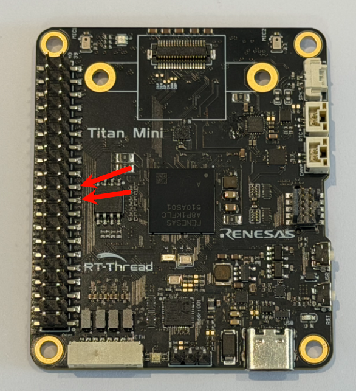
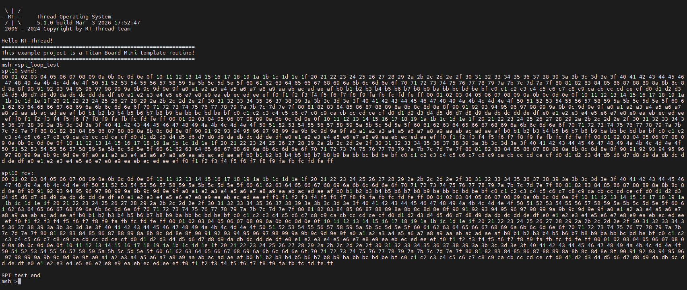

# SPI 驱动示例说明

[**English**](README.md) | **中文**

## 项目介绍

本示例演示如何在 **Titan Board Mini** 开发板上使用 **RT-Thread SPI 设备驱动框架** 进行串行外设接口通信。基于 RA8P1 微控制器的硬件 SPI 外设，支持多种通信模式和高速数据传输。

### 主要特性
- RA8P1 硬件 SPI 初始化与配置
- SPI 主模式通信
- DMA 支持的高速传输
- 多种 SPI 设备集成支持

## 目录结构

```
Titan_Mini_driver_spi/
├── src/
│   └── hal_entry.c          # 主要的SPI驱动代码
├── ra/
│   ├── fsp/src/r_spi_b/     # SPI底层驱动实现
│   └── hal_data.c          # 硬件抽象层配置
├── ra_gen/
│   └── hal_data.c          # 生成的硬件配置
├── libraries/
│   └── M85_Config/
└── README_zh.md            # 中文文档
```

## 1. 硬件介绍 - RA8P1 的 SPI 特性

### 1.1 RA8P1 微控制器概述
RA8P1 是 Renesas RA 系列的 32 位 ARM Cortex-M33 微控制器，专为嵌入式应用设计，具有强大的外设接口和低功耗特性。

### 1.2 SPI 硬件特性

#### 1.2.1 多通道支持
- **SPI0**: 支持 2 个通道
- **SPI1**: 支持 2 个通道
- **SPI2**: 支持 2 个通道
- **SPI3**: 支持 1 个通道
- **SPI4**: 支持 1 个通道
- **OSPI**: 1 个 OctoSPI 通道

#### 1.2.2 高速传输特性
- **最高时钟频率**: 25 MHz (取决于系统配置)
- **DMA 支持**: 双向 DMA 传输，减少 CPU 负担
- **数据位宽**: 支持 1-16 位可配置数据宽度
- **传输模式**: 支持主模式和从模式

#### 1.2.3 时钟配置特性
- **时钟极性 (CPOL)**: 可配置高电平或低电平空闲
- **时钟相位 (CPHA)**: 可配置边沿触发方式
- **时钟分频**: 支持 2-4096 分频
- **时钟源**: 可选择多种时钟源

#### 1.2.4 片选控制
- **多片选支持**: 支持多个从设备
- **软件控制**: 可通过软件控制片选信号
- **硬件控制**: 可自动管理片选信号
- **极性配置**: 支持高电平或低电平有效

### 1.3 SPI 引脚映射

#### Titan Board Mini SPI1 引脚配置
```
SPI1 引脚定义（RA8 命名）:
- MOSI (主出从入):  P708 / BSP_IO_PORT_07_PIN_08
- MISO (主入从出):  P709 / BSP_IO_PORT_07_PIN_09
- SCLK (时钟):      P102 / BSP_IO_PORT_01_PIN_02
- SS (片选):        P105 / BSP_IO_PORT_01_PIN_05
```

**注意**: 实际引脚配置可能根据项目设置有所变化，请参考具体的硬件连接。

## 2. 软件架构 - RT-Thread SPI 设备框架

### 2.1 RT-Thread SPI 架构概览

RT-Thread 提供了完整的 SPI 设备驱动框架，采用分层架构设计：

```
应用程序层
    ↓
SPI 设备层 (rt_spi_device)
    ↓
SPI 总线层 (rt_spi_bus)
    ↓
SPI 操作层 (rt_spi_ops)
    ↓
硬件抽象层 (HAL)
```

### 2.2 主要数据结构

#### 2.2.1 SPI 配置结构
```c
struct rt_spi_configuration {
    rt_uint8_t mode;          /* 工作模式 */
    rt_uint8_t data_width;    /* 数据位宽 */
    rt_uint16_t reserved;     /* 保留字段 */
    rt_uint32_t max_hz;       /* 最大传输频率 */
};
```

#### 2.2.2 SPI 设备结构
```c
struct rt_spi_device {
    struct rt_device parent;          /* 父设备 */
    struct rt_spi_bus *bus;          /* 总线 */
    struct rt_spi_configuration config; /* 配置 */
    rt_base_t cs_pin;                /* 片选引脚 */
    void *user_data;                 /* 用户数据 */
};
```

### 2.3 SPI 工作模式

#### 2.3.1 主从模式
- **主模式 (RT_SPI_MASTER)**: 发起数据传输，控制时钟信号
- **从模式 (RT_SPI_SLAVE)**: 响应主设备命令，接收时钟信号

#### 2.3.2 时钟模式
```c
#define RT_SPI_MODE_0   (0 | 0)        /* CPOL=0, CPHA=0 */
#define RT_SPI_MODE_1   (0 | RT_SPI_CPHA)   /* CPOL=0, CPHA=1 */
#define RT_SPI_MODE_2   (RT_SPI_CPOL | 0)   /* CPOL=1, CPHA=0 */
#define RT_SPI_MODE_3   (RT_SPI_CPOL | RT_SPI_CPHA) /* CPOL=1, CPHA=1 */
```

#### 2.3.3 数据传输模式
- **MSB 优先**: 数据从高位开始传输
- **LSB 优先**: 数据从低位开始传输

### 2.4 核心 API 接口

#### 2.4.1 设备查找
```c
struct rt_spi_device *rt_device_find(const char *name);
```

#### 2.4.2 设备配置
```c
rt_err_t rt_spi_configure(struct rt_spi_device *device,
                          struct rt_spi_configuration *cfg);
```

#### 2.4.3 数据传输
```c
rt_size_t rt_spi_transfer(struct rt_spi_device *device,
                          const void *send_buf,
                          void *recv_buf,
                          rt_size_t length);
```

#### 2.4.4 设备附加
```c
rt_err_t rt_hw_spi_device_attach(const char *bus_name,
                               const char *device_name,
                               void *user_data);
```

## 3. 运行效果示例

使用杜邦线短接开发板树莓派扩展接口的 P708 与 P709 引脚（连接位置如下图所示），以构建回环测试，如下图的位置



完成硬件连接后，编译工程并将固件烧录至开发板。打开串口终端，输入命令 spi_loop_test，即可观察到测试结果



---

**参考文档**:
- [RT-Thread SPI设备文档](https://www.rt-thread.org/document/site/#/rt-thread-version/rt-thread-standard/programming-manual/device/spi/spi)
