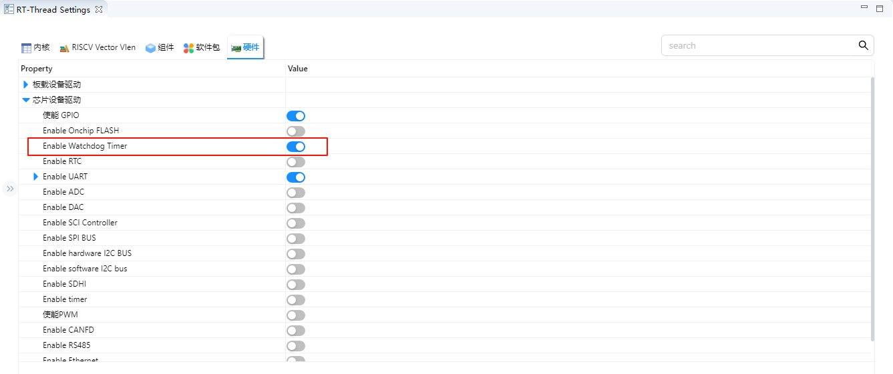
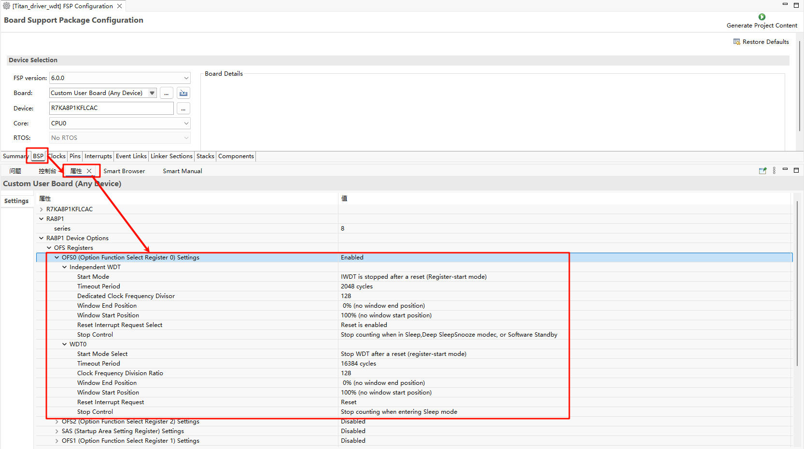
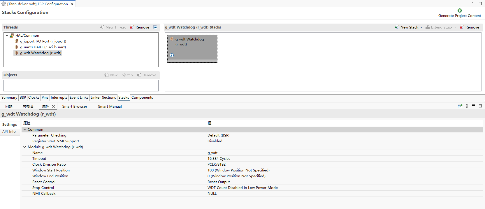
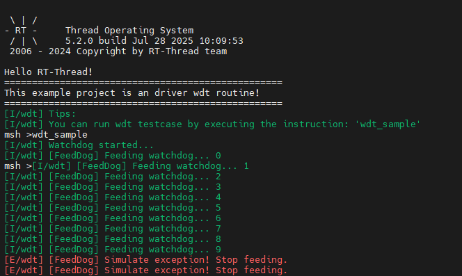

# WDT 驱动示例说明

## 概述

本工程为基于 RT-Thread 操作系统的 **RA8P1 Titan Mini** 板看门狗定时器 (Watchdog Timer, WDT) 驱动示例工程。看门狗定时器是嵌入式系统中重要的可靠性组件，用于监控系统运行状态，在系统出现异常时自动复位，保证系统稳定运行。

## 目录结构

```
project/Titan_Mini_driver_wdt/
├── src/
│   └── hal_entry.c              # 主入口文件，包含看门狗初始化和喂狗线程
├── ra/
│   ├── fsp/
│   │   └── src/
│   │       └── r_wdt/         # Renesas FSP 看门狗驱动源码
│   └── inc/
│       └── api/
│           └── r_wdt_api.h    # 看门狗 API 接口定义
├── ra_cfg/
│   └── fsp_cfg/
│       └── r_wdt_cfg.h         # 看门狗配置
├── rtconfig.h                  # RT-Thread 配置文件
└── Kconfig                     # 工程配置文件
```

## 1. 硬件介绍 - RA8P1的WDT特性

### 1.1 看门狗概述

看门狗定时器是一种特殊的定时器，用于监控系统运行状态。正常情况下，应用程序需要定期"喂狗"（重置定时器），如果应用程序陷入死循环、跑飞或其他异常状态而无法按时喂狗，看门狗就会触发系统复位，确保系统恢复正常。

### 1.2 RA8P1 WDT 主要特性

RA8P1 MCU 内置了功能丰富的看门狗定时器，具有以下特性：

#### 1.2.1 基本特性
- **独立运行**: 看门狗独立于主 CPU 运行，即使在 CPU 停止状态下也能继续计数
- **多种超时时间**: 支持 128、512、1024、2048、4096、8192、16384 个时钟周期的超时设置
- **可配置时钟分频**: 支持 1、4、16、32、64、128、256、512、2048、8192 分频
- **窗口看门狗功能**: 支持窗口看门狗模式，只能在特定时间窗口内喂狗

#### 1.2.2 复位模式
- **复位模式 (Reset Mode)**: 超时后触发系统复位
- **NMI 模式 (NMI Mode)**: 超时后触发不可屏蔽中断 (NMI)，用于错误处理和诊断

#### 1.2.3 工作模式
- **自动启动模式 (Auto-start Mode)**: 复位后自动启动看门狗
- **寄存器启动模式 (Register-start Mode)**: 通过软件控制启动

#### 1.2.4 睡眠模式支持
- **停止控制**: 可配置在睡眠模式下是否停止计数
- **低功耗优化**: 支持低功耗应用场景

### 1.3 硬件参数配置

根据 `hal_entry.c` 中的配置：

```c
#define WDT_DEVICE_NAME "wdt"    // 默认看门狗设备名
#define WDT_FEED_INTERVAL 1000   // 喂狗间隔（单位 ms）
#define WDT_TIMEOUT 3            // 看门狗超时时间（单位 s）
```

## 2. 软件架构 - RT-Thread看门狗设备框架

### 2.1 RT-Thread 看门狗驱动架构

RT-Thread 提供了标准化的看门狗设备驱动框架，通过统一的 API 接口操作不同硬件的看门狗模块。

#### 2.1.1 驱动层次结构

```
应用层
    ↓
RT-Thread 设备驱动层
    ↓
硬件抽象层 (HAL)
    ↓
芯片寄存器操作层
```

#### 2.1.2 主要组件
- **设备管理**: `rt_device` 结构体管理设备实例
- **控制接口**: 提供启动、停止、喂狗等控制功能
- **状态查询**: 获取看门狗运行状态和计数值
- **回调机制**: 支持看门狗事件回调

### 2.2 FSP 集成

本工程使用 Renesas Flexible Software Package (FSP) 提供的底层驱动：

#### 2.2.1 FSP 看门狗 API
```c
typedef struct st_wdt_api {
    fsp_err_t (* open)(wdt_ctrl_t * const p_ctrl, wdt_cfg_t const * const p_cfg);
    fsp_err_t (* refresh)(wdt_ctrl_t * const p_ctrl);
    fsp_err_t (* statusGet)(wdt_ctrl_t * const p_ctrl, wdt_status_t * const p_status);
    fsp_err_t (* statusClear)(wdt_ctrl_t * const p_ctrl, const wdt_status_t status);
    fsp_err_t (* counterGet)(wdt_ctrl_t * const p_ctrl, uint32_t * const p_count);
    fsp_err_t (* timeoutGet)(wdt_ctrl_t * const p_ctrl, wdt_timeout_values_t * const p_timeout);
    fsp_err_t (* callbackSet)(wdt_ctrl_t * const p_ctrl, void (* p_callback)(wdt_callback_args_t *),
                              void * const p_context, wdt_callback_args_t * const p_callback_memory);
} wdt_api_t;
```

#### 2.2.2 配置参数
```c
typedef struct st_wdt_cfg {
    wdt_timeout_t        timeout;                      // 超时时间
    wdt_clock_division_t clock_division;               // 时钟分频
    wdt_window_start_t   window_start;                 // 窗口开始位置
    wdt_window_end_t     window_end;                   // 窗口结束位置
    wdt_reset_control_t  reset_control;                // 复位控制模式
    wdt_stop_control_t   stop_control;                 // 停止控制模式
    void (* p_callback)(wdt_callback_args_t * p_args); // 回调函数
    void * p_context;                                 // 用户上下文
} wdt_cfg_t;
```

### 2.3 RT-Thread 设备配置

在 `rtconfig.h` 中启用看门狗支持：

```c
#define RT_USING_WDT           // 启用看门狗设备支持
#define RT_USING_PIN          // 启用引脚控制支持（用于LED演示）
```

## 3. 使用示例 - 基于实际代码的看门狗初始化、喂狗

### 3.1 主要功能分析

#### 3.1.1 主函数 (`hal_entry`)

```c
void hal_entry(void)
{
    rt_kprintf("\nHello RT-Thread!\n");
    rt_kprintf("==================================================\n");
    rt_kprintf("This example project is an driver wdt routine!\n");
    rt_kprintf("==================================================\n");

    LOG_I("Tips:");
    LOG_I("You can run wdt testcase by executing the instruction: \'wdt_sample\'");

    while (1)
    {
        rt_pin_write(LED_PIN_0, PIN_HIGH);
        rt_thread_mdelay(1000);
        rt_pin_write(LED_PIN_0, PIN_LOW);
        rt_thread_mdelay(1000);
    }
}
```

功能说明：
- 打印欢迎信息和使用提示
- LED 闪烁演示（指示系统正常运行）
- 等待用户执行 `wdt_sample` 命令启动看门狗测试

#### 3.1.2 喂狗线程 (`feed_dog_entry`)

```c
static void feed_dog_entry(void *parameter)
{
    int count = 0;

    while (1)
    {
        if (count < 10)
        {
            rt_device_control(wdt_dev, RT_DEVICE_CTRL_WDT_KEEPALIVE, RT_NULL);
            LOG_I("[FeedDog] Feeding watchdog... %d", count);
        }
        else
        {
            LOG_E("[FeedDog] Simulate exception! Stop feeding.");
        }

        count++;
        rt_thread_mdelay(WDT_FEED_INTERVAL);
    }
}
```

功能说明：
- 创建独立的喂狗线程
- 前10次正常喂狗，之后停止喂狗模拟系统异常
- 通过 RT-Thread 设备控制接口实现喂狗操作

### 3.2 看门狗测试函数 (`wdt_sample`)

```c
static int wdt_sample(void)
{
    rt_err_t ret;

    // 1. 查找看门狗设备
    wdt_dev = rt_device_find(WDT_DEVICE_NAME);
    if (wdt_dev == RT_NULL)
    {
        LOG_E("Cannot find %s device!", WDT_DEVICE_NAME);
        return -1;
    }

    // 2. 启动看门狗
    ret = rt_device_control(wdt_dev, RT_DEVICE_CTRL_WDT_START, RT_NULL);
    if (ret != RT_EOK)
    {
        LOG_E("Start watchdog failed!");
        return -1;
    }

    LOG_I("Watchdog started...", WDT_TIMEOUT);

    // 3. 创建并启动喂狗线程
    feed_thread = rt_thread_create("feed_dog", feed_dog_entry, RT_NULL, 1024, 10, 10);
    if (feed_thread != RT_NULL)
        rt_thread_startup(feed_thread);

    return 0;
}
```

#### 3.2.1 详细步骤解析

**步骤1：查找设备**
```c
wdt_dev = rt_device_find(WDT_DEVICE_NAME);
```
- 使用 `rt_device_find()` 函数查找名为 "wdt" 的设备
- 返回设备句柄，后续操作使用此句柄

**步骤2：启动看门狗**
```c
ret = rt_device_control(wdt_dev, RT_DEVICE_CTRL_WDT_START, RT_NULL);
```
- 使用 `rt_device_control()` 函数发送控制命令
- `RT_DEVICE_CTRL_WDT_START` 启动看门狗
- 返回操作状态码

**步骤3：创建喂狗线程**
```c
feed_thread = rt_thread_create("feed_dog", feed_dog_entry, RT_NULL, 1024, 10, 10);
```
- 创建名为 "feed_dog" 的线程
- 入口函数为 `feed_dog_entry`
- 栈大小 1024 字节
- 优先级 10，时间片 10

### 3.3 RT-Thread 看门狗 API

#### 3.3.1 设备查找和控制
```c
// 查找设备
rt_device_t rt_device_find(const char *name);

// 设备控制
rt_err_t rt_device_control(rt_device_t dev, int cmd, void *arg);
```

常用控制命令：
- `RT_DEVICE_CTRL_WDT_START`: 启动看门狗
- `RT_DEVICE_CTRL_WDT_STOP`: 停止看门狗
- `RT_DEVICE_CTRL_WDT_KEEPALIVE`: 喂狗操作

#### 3.3.2 线程操作
```c
// 创建线程
rt_thread_t rt_thread_create(const char *name,
                           void (*entry)(void *parameter),
                           void *parameter,
                           size_t stack_size,
                           rt_int32_t priority,
                           rt_uint32_t tick);

// 启动线程
rt_err_t rt_thread_startup(rt_thread_t thread);

// 延时
void rt_thread_mdelay(rt_int32_t ms);
```

## 4. 配置说明 - 超时时间、复位模式

### 4.1 超时时间配置

#### 4.1.1 硬件层面的超时设置

RA8P1 WDT 支持多种超时时间配置：

```c
// 超时时间枚举
typedef enum e_wdt_timeout {
    WDT_TIMEOUT_128   = 0,    // 128 个时钟周期
    WDT_TIMEOUT_512   = 1,    // 512 个时钟周期
    WDT_TIMEOUT_1024  = 2,    // 1024 个时钟周期
    WDT_TIMEOUT_2048  = 3,    // 2048 个时钟周期
    WDT_TIMEOUT_4096  = 4,    // 4096 个时钟周期
    WDT_TIMEOUT_8192  = 5,    // 8192 个时钟周期
    WDT_TIMEOUT_16384 = 6,    // 16384 个时钟周期
} wdt_timeout_t;
```

### 4.2 复位模式配置

#### 4.2.1 复位模式选择

```c
// 复位控制枚举
typedef enum e_wdt_reset_control {
    WDT_RESET_CONTROL_NMI   = 0,  // NMI/IRQ 请求模式
    WDT_RESET_CONTROL_RESET = 1,  // 复位模式
} wdt_reset_control_t;
```

#### 4.2.2 模式特性对比

| 模式 | 特点 | 适用场景 |
|------|------|----------|
| **复位模式** | 超时后直接触发系统复位 | 一般应用，需要自动恢复 |
| **NMI模式** | 超时后触发不可屏蔽中断 | 诊断和调试，需要在复位前处理 |

## 5.WDT工程配置

首先需要在RT-Thread Studio Settings打开Watchdog Timer



随后使用 Renesas Flexible Software Package (FSP) 进行硬件配置,如下图






## 5. 运行效果示例

### 5.1 正常运行流程




## 结论

RA8P1 Titan Mini 板看门狗定时器驱动工程通过精心设计和实现，提供了一个稳定、可靠的看门狗解决方案。该方案不仅满足了基本的看门狗功能需求，还具备良好的扩展性和实用性，适用于各种嵌入式应用场景。