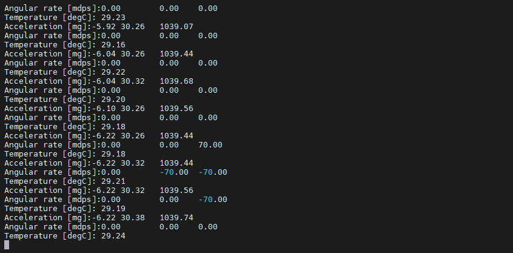

# IMU 传感器示例说明

**中文** | [**English**](./README.md)

## 简介

本示例展示了如何在 **Titan Board Mini** 上使用 **LSM6DS3TR-C 六轴 IMU 传感器** 实现惯性测量功能,通过 **I2C 接口**读取 **3轴加速度计** 和 **3轴陀螺仪** 数据,结合 **RT-Thread 传感器框架** 实现完整的传感器数据采集和处理。

主要功能包括：

- 使用 LSM6DS3TR-C 实现 6 轴惯性测量
- 读取 3 轴加速度计数据 (X/Y/Z)
- 读取 3 轴陀螺仪数据 (X/Y/Z)
- 支持多种量程和采样率配置
- 集成 RT-Thread 传感器框架

## 硬件介绍

### 1. LSM6DS3TR-C IMU 传感器

**Titan Board Mini** 板载 **LSM6DS3TR-C** 高性能六轴 IMU 传感器：

| 参数 | 说明 |
|------|------|
| **型号** | LSM6DS3TR-C |
| **制造商** | STMicroelectronics (意法半导体) |
| **类型** | 6 轴 IMU (3轴加速度计 + 3轴陀螺仪) |
| **接口** | I2C / SPI |
| **工作电压** | 1.71V - 3.6V |
| **温度范围** | -40°C ~ +85°C |
| **封装** | 2.5mm x 3mm x 0.83mm LGA-14 |

### 2. 加速度计特性

LSM6DS3TR-C 内置高性能 3 轴加速度计：

- **量程选择**：±2g / ±4g / ±8g / ±16g
- **分辨率**：16-bit ADC
- **输出数据率**：1.6Hz - 6.66kHz
- **噪声密度**：90μg/√Hz
- **零偏偏差**：±40mg
- **带宽**：可配置 (通常 50Hz - 1.6kHz)

### 3. 陀螺仪特性

LSM6DS3TR-C 内置高精度 3 轴陀螺仪：

- **量程选择**：±125 / ±250 / ±500 / ±1000 / ±2000 dps
- **分辨率**：16-bit ADC
- **输出数据率**：1.6Hz - 6.66kHz
- **噪声密度**：3.8mdps/√Hz
- **零偏稳定性**：±5dps
- **带宽**：可配置

### 4. 主要功能

#### 高级功能

- **FIFO 缓存**：9KB FIFO,支持多种模式
- **中断功能**：运动唤醒、自由落体、6D方向检测
- **传感器融合**：内置低功耗传感器融合算法
- **自检功能**：支持自检模式
- **低功耗模式**：多种低功耗工作模式

#### 数据处理

- **硬件滤波**：可配置数字滤波器
- **数据融合**：支持加速度计+陀螺仪数据融合
- **时间戳**：内置时间戳功能
- **轮询/中断**：支持轮询和中断数据读取

## 软件架构

### 1. 分层设计

IMU 传感器系统采用分层架构：

```
应用程序层 (用户代码)
    ↓
RT-Thread Sensor Framework - 传感器框架
    ↓
LSM6DS3TR-C Driver - IMU驱动
    ↓
Sensor HAL - 传感器硬件抽象层
    ↓
I2C/SPI Driver - I2C/SPI驱动
    ↓
FSP I2C/SPI HAL - 硬件抽象层
```

### 2. 核心组件

#### 移植层接口

需要实现的平台相关接口 (`lsm6ds3tr-c_port.c`)：

```c
/* I2C 读写接口 */
int32_t platform_write(void *handle, uint8_t reg, const uint8_t *bufp, uint16_t len);
int32_t platform_read(void *handle, uint8_t reg, uint8_t *bufp, uint16_t len);

/* 延时接口 */
void platform_delay(uint32_t ms);
```

#### RT-Thread 传感器框架

RT-Thread 提供的统一传感器设备接口：

```c
/* 查找传感器设备 */
rt_device_t rt_device_find(const char *name);

/* 打开传感器设备 */
rt_err_t rt_device_open(rt_device_t dev, rt_uint16_t oflags);

/* 读取传感器数据 */
rt_size_t rt_device_read(rt_device_t dev, rt_off_t pos, void *buffer, rt_size_t size);

/* 接收传感器数据 */
rt_err_t rt_device_set_rx_indicate(rt_device_t dev, rt_err_t (*rx_ind)(rt_device_t dev, rt_size_t size));
```

### 3. 工程结构

```
Titan_Mini_peripheral_imu/
├── src/
│   └── hal_entry.c          # 主程序入口
└── packages/
    └── lsm6ds3tr/           # LSM6DS3TR-C 驱动包
        ├── lsm6ds3tr-c_reg.h    # 寄存器定义和驱动接口
        ├── lsm6ds3tr-c_reg.c    # 寄存器级驱动实现
        └── lsm6ds3tr-c_port.c   # 平台移植层
```

## 使用说明

### 1. 初始化流程

系统初始化时需要初始化 I2C 接口和 IMU 传感器：

```c
#include <rtthread.h>
#include "lsm6ds3tr-c_reg.h"

/* I2C 配置 */
#define LSM6DS3TR_C_I2C_BUS    "i2c2"
#define LSM6DS3TR_C_I2C_ADDR    0x6A  /* SA0引脚接GND */

void hal_entry(void)
{
    stmdev_ctx_t imu_ctx = {0};

    /* 初始化 I2C 接口 */
    struct rt_i2c_bus_device *i2c_bus = rt_i2c_bus_device_find(LSM6DS3TR_C_I2C_BUS);
    if (i2c_bus == RT_NULL)
    {
        rt_kprintf("I2C bus not found!\n");
        return;
    }

    /* 配置设备读写接口 */
    imu_ctx.handle    = i2c_bus;
    imu_ctx.write_reg = platform_write;
    imu_ctx.read_reg  = platform_read;

    /* 初始化传感器 */
    if (lsm6ds3tr_c_init(&imu_ctx) != LSM6DS3TR_C_OK)
    {
        rt_kprintf("LSM6DS3TR-C initialization failed!\n");
        return;
    }

    /* 配置加速度计 */
    lsm6ds3tr_c_xl_full_scale_set(&imu_ctx, LSM6DS3TR_C_2g);          /* ±2g */
    lsm6ds3tr_c_xl_data_rate_set(&imu_ctx, LSM6DS3TR_C_ODR_104Hz);  /* 104Hz */

    /* 配置陀螺仪 */
    lsm6ds3tr_c_gy_full_scale_set(&imu_ctx, LSM6DS3TR_C_250dps);    /* ±250dps */
    lsm6ds3tr_c_gy_data_rate_set(&imu_ctx, LSM6DS3TR_C_ODR_104Hz);  /* 104Hz */

    rt_kprintf("LSM6DS3TR-C initialized successfully!\n");

    /* 主循环 - 读取传感器数据 */
    while (1)
    {
        /* 读取加速度计数据 */
        lsm6ds3tr_c_axis3bit16_t acc_raw;
        lsm6ds3tr_c_acceleration_raw_get(&imu_ctx, &acc_raw);

        /* 读取陀螺仪数据 */
        lsm6ds3tr_c_axis3bit16_t gyro_raw;
        lsm6ds3tr_c_angular_rate_raw_get(&imu_ctx, &gyro_raw);

        /* 数据转换为物理单位 */
        float acc_x = acc_raw.i16bit[0] / 32768.0f * 2.0f;  /* 2g 量程 */
        float acc_y = acc_raw.i16bit[1] / 32768.0f * 2.0f;
        float acc_z = acc_raw.i16bit[2] / 32768.0f * 2.0f;

        float gyro_x = gyro_raw.i16bit[0] / 32768.0f * 250.0f;  /* 250dps 量程 */
        float gyro_y = gyro_raw.i16bit[1] / 32768.0f * 250.0f;
        float gyro_z = gyro_raw.i16bit[2] / 32768.0f * 250.0f;

        /* 打印数据 */
        rt_kprintf("ACC: X=%.3fg Y=%.3fg Z=%.3fg | GYRO: X=%.2fdps Y=%.2fdps Z=%.2fdps\n",
                   acc_x, acc_y, acc_z, gyro_x, gyro_y, gyro_z);

        rt_thread_mdelay(100);  /* 10Hz 读取频率 */
    }
}
```

### 2. I2C 平台接口实现

移植层需要实现 I2C 读写函数：

```c
#include <rtthread.h>
#include <rtdevice.h>

/* I2C 写入 */
int32_t platform_write(void *handle, uint8_t reg, const uint8_t *bufp, uint16_t len)
{
    struct rt_i2c_bus_device *i2c_bus = (struct rt_i2c_bus_device *)handle;
    struct rt_i2c_msg msgs[2];

    /* 写寄存器地址 */
    msgs[0].addr  = LSM6DS3TR_C_I2C_ADDR;
    msgs[0].flags = RT_I2C_WR;
    msgs[0].buf   = &reg;
    msgs[0].len   = 1;

    /* 写数据 */
    msgs[1].addr  = LSM6DS3TR_C_I2C_ADDR;
    msgs[1].flags = RT_I2C_WR | RT_I2C_NO_START;
    msgs[1].buf   = (uint8_t *)bufp;
    msgs[1].len   = len;

    if (rt_i2c_transfer(i2c_bus, msgs, 2) != 2)
    {
        return -1;
    }
    return 0;
}

/* I2C 读取 */
int32_t platform_read(void *handle, uint8_t reg, uint8_t *bufp, uint16_t len)
{
    struct rt_i2c_bus_device *i2c_bus = (struct rt_i2c_bus_device *)handle;
    struct rt_i2c_msg msgs[2];

    /* 写寄存器地址 */
    msgs[0].addr  = LSM6DS3TR_C_I2C_ADDR;
    msgs[0].flags = RT_I2C_WR;
    msgs[0].buf   = &reg;
    msgs[0].len   = 1;

    /* 读数据 */
    msgs[1].addr  = LSM6DS3TR_C_I2C_ADDR;
    msgs[1].flags = RT_I2C_RD;
    msgs[1].buf   = bufp;
    msgs[1].len   = len;

    if (rt_i2c_transfer(i2c_bus, msgs, 2) != 2)
    {
        return -1;
    }
    return 0;
}

/* 延时函数 */
void platform_delay(uint32_t ms)
{
    rt_thread_mdelay(ms);
}
```

### 3. 数据格式转换

传感器原始数据需要转换为物理单位：

```c
/* 加速度计数据转换 (假设 2g 量程) */
int16_t acc_raw_x = 16384;  /* 原始 ADC 值 */
float acc_x_g = (float)acc_raw_x / 32768.0f * 2.0f;  /* 转换为 g (9.8m/s²) */
float acc_x_m_s2 = acc_x_g * 9.80665f;  /* 转换为 m/s² */

/* 陀螺仪数据转换 (假设 250dps 量程) */
int16_t gyro_raw_x = 1000;  /* 原始 ADC 值 */
float gyro_x_dps = (float)gyro_raw_x / 32768.0f * 250.0f;  /* 转换为 °/s */
float gyro_x_rad_s = gyro_x_dps * 0.017453292519943295f;  /* 转换为 rad/s */
```

## 配置说明

### 1. Kconfig 配置

在 `libraries/M85_Config/Kconfig` 中配置 IMU 选项：

```kconfig
menuconfig BSP_USING_IMU
    bool "Enable IMU (LSM6DS3TR-C)"
    select BSP_USING_I2C2
    default n
    if BSP_USING_IMU
        config BSP_IMU_I2C_BUS
            string "I2C bus name"
            default "i2c2"

        config BSP_IMU_ACC_ODR
            int "Accelerometer ODR (Hz)"
            default 104

        config BSP_IMU_GYRO_ODR
            int "Gyroscope ODR (Hz)"
            default 104
    endif
```

### 2. RT-Thread Settings

在 RT-Thread Studio 中,需要启用以下组件：

1. **设备驱动**
   - 启用 I2C 设备驱动
   - 配置 I2C2 接口

2. **传感器**
   - 启用 RT-Thread Sensor 框架
   - 启用 Accel (加速度计) 传感器
   - 启用 Gyro (陀螺仪) 传感器

3. **软件包**
   - 添加 LSM6DS3TR-C 驱动包

## 运行效果

### 1. 终端输出

复位 Titan Board Mini 后终端会输出如下信息：



## 相关资料

- [RT-Thread 传感器框架文档](https://www.rt-thread.org/document/site/#/rt-thread-version/rt-thread-standard/programming-manual/device/sensor/sensor)
