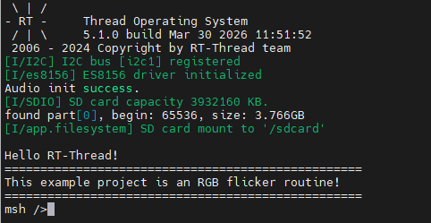

# WAV Audio Player Example

**English** | [**中文**](README_zh.md)

## Introduction

This example demonstrates how to play **WAV format audio files** on the **Titan Board Mini** using the **ES8156 Audio Codec** via the **SSI (Synchronous Serial Interface)**, combined with the **RT-Thread Audio Framework** for complete audio playback functionality.

Main features include:

- High-quality audio playback using ES8156 codec
- WAV format audio file playback support
- I2S audio data transmission via SSI interface
- Volume control, pause/resume/stop playback control
- Audio file reading from SD card or Flash file system

## Hardware Introduction

### 1. ES8156 Audio Codec

The **Titan Board Mini** features the **ES8156** high-performance audio codec:

| Parameter | Description |
|-----------|-------------|
| **Model** | ES8156 |
| **Manufacturer** | Everest Semiconductor |
| **Type** | Stereo DAC (Digital-to-Analog Converter) |
| **Resolution** | 24-bit |
| **Sample Rate** | 8kHz - 192kHz |
| **SNR** | > 100dB |
| **Output Power** | 30mW + 30mW @ 16Ohm |
| **Interface** | I2S / PCM |
| **Control Interface** | I2C |
| **Operating Voltage** | 1.8V - 3.6V |

### 2. ES8156 Key Features

#### Audio Performance

- **High-fidelity audio**: 24-bit DAC, supporting high-resolution audio
- **Wide sample rate range**: 8kHz - 192kHz, covering various audio scenarios
- **Low noise**: > 100dB SNR for clear audio quality
- **Low distortion**: THD+N < -85dB
- **Multi-format support**: I2S, Left-justified, Right-justified, PCM

#### Output Characteristics

- **Stereo output**: Left and right channels independent output
- **Headphone driver**: Built-in headphone amplifier, direct drive for 16Ohm - 32Ohm headphones
- **Line output**: Line-level output support
- **Volume control**: Digital volume control, range 0-255, +/-0.5dB/Step

### 3. SSI (Synchronous Serial Interface)

The SSI interface on RA8P1 is used for audio data transmission:

- **I2S protocol**: Standard I2S audio protocol
- **Master/Slave mode**: Configurable as master or slave
- **DMA support**: DMA transfer support, reducing CPU usage
- **Multi-channel**: Support for mono/stereo

## Software Architecture

### 1. Layered Design

The audio playback system uses a layered architecture:

```
Application Layer (User Code)
    ↓
WAV Player Package - WAV Player
    ↓
Audio Device Framework - RT-Thread Audio Device Framework
    ↓
ES8156 Driver - ES8156 Driver
    ↓
SSI/I2S Driver - SSI/I2S Driver
    ↓
FSP SSI HAL - Hardware Abstraction Layer
```

### 2. Core Components

#### WAV Player Package

RT-Thread's WAV player package provides complete audio playback functionality:

- **WAV file parsing**: Parse WAV file header, extract audio parameters
- **Playback control**: Play, pause, resume, stop
- **Volume control**: 0-99 level volume adjustment
- **State management**: Playback state machine management
- **Multi-file support**: Support playback from different storage media

**Main interfaces** (`wavplayer.h`):

```c
/* Play WAV file */
int wavplayer_play(char *uri);

/* Stop playback */
int wavplayer_stop(void);

/* Pause playback */
int wavplayer_pause(void);

/* Resume playback */
int wavplayer_resume(void);

/* Set volume (0-99) */
int wavplayer_volume_set(int volume);

/* Get volume */
int wavplayer_volume_get(void);

/* Get playback state */
int wavplayer_state_get(void);
```

#### ES8156 Driver

The ES8156 driver provides codec control interfaces:

```c
/* Initialize ES8156 */
rt_err_t es8156_device_init(void);

/* Get device handle */
struct es8156_device *es8156_get_device(void);

/* Set volume (0-255) */
void es8156_set_volume(rt_uint8_t volume);

/* Mute/Unmute */
void es8156_mute(rt_bool_t mute);

/* Power down */
void es8156_powerdown(void);
```

**Driver configuration**:
- **I2C interface**: I2C1 (for register configuration)
- **I2C address**: 0x08 (ADDR pin connected to GND)
- **Analog voltage**: 3.3V (configurable 1.8V/3.3V)
- **Default volume**: 191 (0dB)

### 3. Project Structure

```
Titan_Mini_wavplayer/
├── src/
│   └── hal_entry.c          # Main program entry
├── libraries/
│   └── HAL_Drivers/ports/
│       └── es8156/
│           ├── es8156.c     # ES8156 driver implementation
│           └── es8156.h     # ES8156 driver header
└── packages/
    └── wavplayer-latest/    # WAV player package
        ├── inc/
        │   ├── wavplayer.h  # Player interface
        │   ├── wavrecorder.h # Recorder interface
        │   └── wavhdr.h     # WAV file header definitions
        └── src/
            ├── wavplayer.c      # Player implementation
            ├── wavplayer_cmd.c  # Player commands
            ├── wavhdr.c         # WAV file parsing
            └── wavrecorder.c    # Recorder implementation
```

## Usage

### 1. Initialization Flow

The system needs to initialize ES8156 and audio device during startup:

```c
#include <rtthread.h>
#include "es8156.h"

void hal_entry(void)
{
    /* Initialize ES8156 codec */
    if (es8156_device_init() != RT_EOK)
    {
        rt_kprintf("ES8156 initialization failed!\n");
        return;
    }

    rt_kprintf("ES8156 audio codec initialized successfully!\n");
    rt_kprintf("WAV Player is ready!\n");

    /* Main loop */
    while (1)
    {
        /* Application logic */
        rt_thread_mdelay(1000);
    }
}
```

### 2. Playing WAV Files

Use msh command line to play audio files:

```bash
/* Play WAV file from SD card */
msh >wavplay -s /sdcard/test.wav
```

### 3. WAV File Format Requirements

WAV files must meet the following requirements:

- **Format**: Standard WAV (RIFF) format
- **Encoding**: PCM encoding
- **Sample rate**: 16kHz
- **Bit depth**: 16-bit
- **Channels**: Mono or stereo
- **File extension**: .wav

## Configuration

### 1. Kconfig Configuration

Configure audio options in `libraries/M85_Config/Kconfig`:

```kconfig
menuconfig BSP_USING_AUDIO
    bool "Enable Audio"
    select BSP_USING_SSI0
    select BSP_USING_ES8156
    default n
    if BSP_USING_AUDIO
        config BSP_USING_AUDIO_VOLUME
            int "Default volume (0-99)"
            default 50
    endif
```

### 2. RT-Thread Settings

In RT-Thread Studio, enable the following components:

1. **Device drivers**
   - Enable SSI/I2C device drivers
   - Enable Audio device

2. **Packages**
   - Add wavplayer-latest package

3. **Components**
   - Enable DFS file system
   - Enable SD card file system

### 3. Hardware Connections

ES8156 connections to Titan Board Mini:

- **I2C control interface**:
  - I2C1_SDA / I2C1_SCL
  - Used for ES8156 register configuration

- **I2S audio interface**:
  - SSI_TX (audio data output)
  - SSI_BCK (bit clock)
  - SSI_LRCK (left/right channel clock)
  - SSI_MCK (master clock, optional)

## Run Effect

Convert the song to 2-channel 16kHz sample rate WAV format, save it to the SD card, insert the SD card into the development board. After powering on, the system will automatically mount the SD card. Then enter the command `wavplay -s <filename>` to play.



## Further Reading

- [RT-Thread Audio Framework Documentation](https://www.rt-thread.org/document/site/#/rt-thread-version/rt-thread-standard/programming-manual/device/audio/audio)
